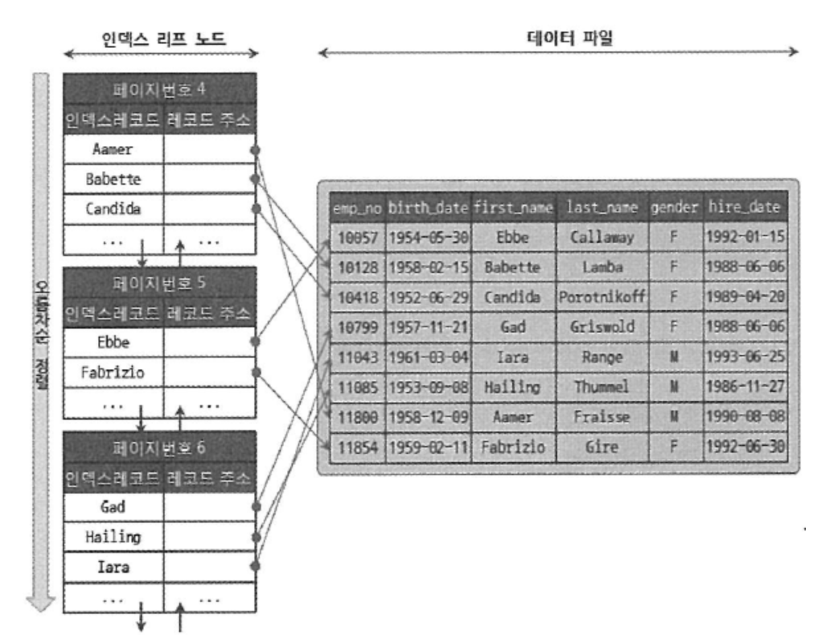
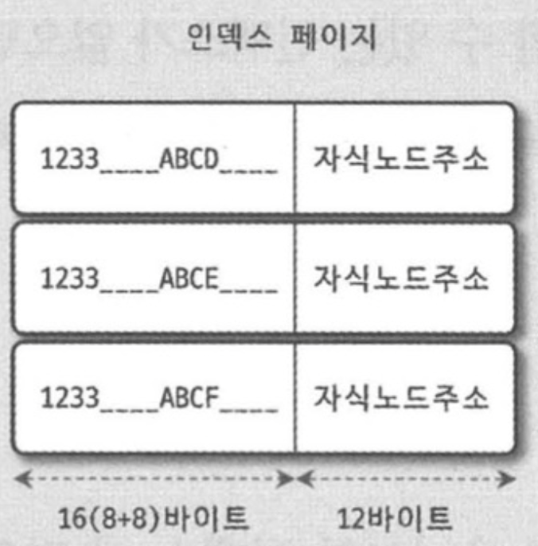

# 8. 인덱스

## 8.1 디스크 읽기 방식

- 컴퓨터의 cpu나 메모리 장치는 매우 빠르게 발전했지만, 반대로 디스크는 제한적으로 발전했다.
- **SSD**처럼 빠른 디스크가 활용되더라도, 여전히 컴퓨터에서 **가장 느린 부분**이라는 사실은 변함이 없고
DB 성능 튜닝은 어떻게 디스크 I/O를 줄이느냐가 관건이다.

### 8.1.1 HDD와 SSD

- SSD는 기존 하드 디스크에서 원판을 제거하고 플래시 메모리를 장착하고 있다. 원판을 기계적으로 회전시킬 필요가 없어서
빠르게 데이터를 읽고 쓸 수 있다.
- 컴퓨터 장치의 1초당 처리 횟수
  - 메모리가 SSD보다 1000배 더 많이 처리할 수 있으며 요즘은 DBMS로 사용하는 서버가 대부분 SSD를 사용한다.

```text
cpu: 1,000,000,000
Dram:  100,000,000
SSD:       100,000
HDD:           200
```

- 디스크 헤더를 움직이지 않고 순차적으로 데이터를 읽는 I/O에서는 SSD랑 HDD랑 크게 차이가 없다.
- SSD의 장점은 랜덤 I/O가 HDD보다 훨씬 빠르다는 점이다. DB에서 순차 I/O 작업보다는 랜덤 I/O 작업이 많이 
일어나기 때문에 SSD는 DBMS 스토리지에 최적이라고 볼 수 있다.

### 8.1.2 랜덤 I/O와 순차 I/O

- **랜덤 I/O와 순차 I/O**의 차이를 먼저 보자. 3개의 데이터를 **디스크에 쓴다고 가정**할 때
디스크에 기록해야 할 위치를 찾기 위해 순차 I/O는 디스크 헤더를 1번 움직였고 랜덤 I/O는 3번 움직였다.
- 디스크에 데이터를 쓰고 읽는데 걸리는 시간은 디스크 헤더를 움직여서 읽고 쓸 위치로 옮기는 단계에서 결정된다.
즉, 디스크 헤더의 위치 이동없이 얼마나 많은 데이터를 한 번에 기록하느냐에 의해 결정된다.
- **SSD의 경우** 디스크 원판을 가지고 있진 않지만 여전히 랜덤 I/O가 순차 I/O보다 성능이 떨어진다.
- 쿼리를 튜닝한다는 것은 랜덤 I/O 자체를 줄여주는 것이 목적이고, 쿼리를 처리하면서 꼭 필요한 데이터를 읽도록 쿼리를 개선한다는 의미이다.

## 8.2 인덱스란?

- 인덱스란, 인덱스로 정한 칼럼의 값과 해당 레코드가 저장된 주소를 key-value로 삼아 만들어 둔 것이다.
- 책의 찾아보기와 인덱스의 공통점은 정렬이다. 책의 찾아보기도 내용이 많아지면 ㄱ,ㄴ,ㄷ 순으로 정렬하는데
인덱스도 마찬가지로 주어진 칼럼의 값으로 미리 정렬해서 보관해둔다.
- 인덱스는 저장될 때마다 값을 정렬해야 하므로 저장하는 과정이 복잡하고 느리지만, 이미 정렬되어 있기 때문에
원하는 값을 빠르게 찾아올 수 있다.
- 결론적으로 인덱스는 **저장(insert, update, delete) 성능을 희생하고 데이터의 읽기 속도를 높이는 기능**이다.
- 인덱스는 **프라이머리 키와 세컨더리 키**로 구분할 수 있다.
  - 프라이머리 키는 id 처럼 레코드를 대표하는 식별 값으로 null을 허용하지 않으며 중복을 허용하지 않는다.
  - 프라이머리 키를 제외한 모든 인덱스는 세컨더리 인덱스로 분류한다.
- 인덱스를 저장방식(알고리즘)으로 구분할 경우 대표적으로 **B-Tree 인덱스와 Hash 인덱스**로 구분된다.
  - B-Tree 인덱스는 가장 일반적으로 사용하고 성숙해진 상태다. 
  - Hash 인덱스는 컬럼의 값으로 해시값을 계산하는 방식으로 매우 빠른 검색을 지원하며 주로 메모리 기반의 DB에서 사용된다.

## 8.3 B-Tree 인덱스

### 8.3.1 B-Tree 인덱스

- B-Tree 인덱스를 이해하려면 B-Tree의 기본적인 구조를 알아야 한다.
- B-Tree는 최상위에 하나의 루트 노드가 존재하고, 가장 하위에 리프 노드가 있으며 중간에 있는 노드를 브랜치 노드라고 한다.
- 인덱스의 **리프 노드**는 항상 실제 **데이터 레코드의 주소값**을 가지고 있다.
- 인덱스의 키 값은 정렬되어 있지만 디스크의 데이터는 임의의 순서로 저장된다.
- 인덱스는 테이블의 키 칼럼만 가지고 있고 나머지 데이터는 레코드에서 찾아야 한다. 이를 위해 인덱스의 리프 노드는 데이터
파일에 저장된 레코드의 주소를 가진다. 아래 예시는 B-Tree 리프노드와 MyISAM 저장 방식이다.
  
- MyISAM은 인덱스의 리프노드에 물리적인 주소를 가지는 반면, InnoDB 테이블은 프라이머리 키를 가지고 있어 논리적인 주소를 가진다고 볼 수 있다. 따라서 InnoDB 테이블에서 인덱스를 통해 레코드를 읽을 때는 데이터를 바로 찾아가지 못하고
인덱스에 저장돼 있는 프라이머리 키에 해당하는 프라이머리 키 인덱스의 리프 노드에 저장된 레코드를 읽는다.
- 즉, InnoDB에서 물리적인 주소를 가지는 건 프라이머리 키 인덱스의 리프 노드이며, InnoDB 스토리지 엔진에서는 모든 세컨더리 인덱스 검색에서 데이터 레코드를 읽기 위해 반드시 프라이머리 키를 저장하고 있는 B-Tree를 다시 한 번 검색해야 한다.
- 성능이 떨어질 것 처럼 보이지만 사실은 각각의 장단점이 있다.

### 8.3.2 B-Tree 인덱스 키 추가 & 삭제

- 새로운 인덱스 키 값이 B-Tree에 저장될 때, 저장할 위치를 찾고 레코드의 키 값과 레코드의 주소 정보를 
B-Tree 리프노드에 저장한다. 만약 리프 노드가 꽉 차서 저장할 수 없을 때 분리해야 하는데 이는 상위 브랜치 노드까지
처리해야 하는 작업으로, 상대적으로 새로운 키를 추가하는 작업은 비용이 많이 드는 것으로 알려졌다.
- **인덱스 키 삭제**는, 키 값이 저장된 리프 노드를 찾아 삭제 마크만 하기 때문에 간단하다.
- **인덱스 키 수정**은, 기존 인덱스 키 값을 삭제 후 새로운 인덱스 키 값을 추가하는 작업으로 처리된다.
- **인덱스 키 검색**은 트리 탐색을 통해 루트 노드 -> 브랜치 노드 -> 리프 노드까지 이동하는데, 인덱스의 키 값이 변형된 후
비교되어 질 경우 인덱스를 탈 수 없다.

### 8.3.3 B-Tree 인덱스에 영향을 미치는 요소

#### 8.3.3.1 인덱스 키 값의 크기

- InnoDB 스토리지 엔진은 디스크에 데이터를 저장하는 가장 기본 단위를 페이지 or 블록이라고 하며 디스크의 읽기/쓰기 작업의
최소 작업 단위가 된다.
- 이진트리는 각 노드가 자식 노드를 2개만 가지는데 DBMS의 B-Tree가 이진 트리라면 인덱스 검색이 비효율적이다.
**B-Tree는 Balanced Tree**로 DBMS의 B-Tree 자식 노드의 개수는 가변적이다.
- MySQL의 경우 페이지의 기본 크기가 16KB라면, 인덱스 키가 16KB이고 자식 노드의 크기가 12 바이트일 때 하나의 인덱스 페이지(16KB)에 몇 개의 키를 저장할 수 있을까? 
 
  - 계산해보면 16KB = 16 * 1024 / (16+12) = 585개 저장할 수 있다.
  - 만약 키가 32바이트로 늘어나면 16 * 1024 / (32+12) = 372개를 저장할 수 있다.
  - 만약 select 쿼리가 500개를 읽어야 한다면 전자는 인덱스 페이지 한 번으로 해결되지만 후자는 최소한 2번 이상 디스크에서 읽어야 한다.
  - 결국 인덱스의 키 값의 크기가 커지면 디스크로부터 읽어야 하는 횟수가 늘어나고 그만큼 느려진다는 의미이다.

#### 8.3.3.2 B-Tree 깊이

- 인덱스의 키 값과 연결되는데, 키 값의 크기가 커지면 하나의 인덱스 페이지에 담을 수 있는 개수가 적어지고 그 때문에 B-Tree의 깊이가 깊어져서 디스크 읽기가 더 많이 필요하다.

#### 8.3.3.3 카디널리티

- 모든 인덱스 키 값 가운데 유니크한 값의 수를 의미한다.
- 만약 데이터가 1만건이 저장되어 있고 
  - 유니크한 값의 개수가 10개라고 가정하자.
    - 인덱스로 하나의 키 값을 검색했을 때 평균적으로 1000개의 데이터를 읽었기 때문에 1건을 위해 999건을 불필요하게 읽는다.
  - 유니크한 값의 개수가 1000개라고 가정하자.
    - 인덱스로 하나의 키 값을 검색했을 때 평균적으로 10개의 데이터를 읽었기 때문에 1건을 읽고 9건만 불필요하게 읽는다.

#### 8.3.3.4 읽어야 하는 데이터 건수

- 데이터가 100만 건이 저장되어 있는데 이 중, 50만 건을 읽어야 한다고 가정해보자.
  - 전체 데이터를 읽어서 필요없는 50만 건을 버리는게 좋을지, 인덱스를 통해 50만건만 읽어오는게 좋을지 판단해야 한다.
  - 인덱스의 손익 분기점은, 인덱스로 1건을 읽는게 직접 레코드 1건을 읽는 것보다 4~5배 비용이 든다.
  - 즉 인덱스를 통해 읽어야 할 레코드 건수가 전체 테이블 레코드에 20~25%를 넘어서면 풀스캔 후 필터링 하는 방식이 효율적이다.

### 8.3.4 B-Tree 인덱스를 통한 데이터 읽기

- MySQL이 인덱스를 이용하는 대표적인 세 가지를 살펴보자.

#### 8.3.4.1 인덱스 레인지 스캔

- 인덱스 사용방법 중 빠른방법에 속하며, 책에서는 인덱스를 통해 **한 건만 읽거나 한 건 이상**을 읽는 경우 `인덱스 레인지 스캔`이라고 표현했다. 예를 들어 아래와 같이 검색해야 할 범위가 결정됐을 때 사용하는 방식이다.

  ```sql
    select * from employee where first_name between 'sam' and 'tom';
  ```

- 인덱스 레인지 스캔은 **검색해야 할 인덱스의 범위가 결정될 때** 사용하며 한 건이건 여러 건이건 레인지 스캔이라고 표현한다.
  - `루트 -> 브랜치 -> 리프` 노드에서 필요한 레코드 시작점을 찾으면, **레코드 시작점부터 차례대로 읽는 것**을 스캔이라 표현한다.
  - 스캔하다가 리프 노드의 끝까지 읽으면, 리프 노드 간의 링크를 통해 다음 리프 노드를 찾아 다시 스캔한다. 찾아야 할 마지막
    위치에 이동하면 지금까지 읽은 레코드를 반환하고 쿼리를 종료한다. 
- 인덱스 레인지 스캔은 아래 3단계를 거친다.
  - 1. 인덱스에서 조건을 만족하는 값이 저장된 위치를 찾는다.
  - 2. 위에서 탐색된 위치부터 필요한 만큼 인덱스를 차례대로 쭉 읽는다. 이 과정을 인덱스 스캔이라 한다.
  - 3. 2번에서 읽은 인덱스 키에 해당하는 레코드 주소를 이용해 디스크에서 페이지를 읽어온다.
- 쿼리에 따라 3번 과정이 필요하지 않다면, 이를 커버링 인덱스라고 한다.
  - 디스크의 레코드를 읽지 않아도 되기 때문에 랜덤 I/O가 줄어들고 성능은 그만큼 빨라진다.

#### 8.3.4.2 인덱스 풀 스캔

- 인덱스를 사용하지만, 인덱스의 처음부터 끝까지 모두 읽는 방식을 인덱스 풀 스캔이라고 한다.
  - 대표적으로 쿼리 조건절에 사용된 컬럼이 복합 인덱스의 첫 번째 컬럼이 아닌 경우 풀 스캔이 사용된다.
  - ex) 인덱스는 a,b,c 순으로 만들어져 있는데 조건절의 컬럼은 b, c 컬럼으로 검색하는 경우다.
- 인덱스 크기는 테이블 크기보다 작으므로, 테이블 전체를 읽는 것보다는 인덱스만 읽는 것이 효율적이다.
  - 쿼리가 인덱스에 명시된 컬럼만으로 조건을 처리할 수 있는 경우 이 방식이 사용된다.
  - 디스크에 저장된 레코드까지 읽어야 한다면 이 방식으로 처리되지 않는다.
- 테이블 전체를 읽는 것보다는 좋지만 인덱스 풀 스캔 방식은 인덱스를 효율적으로 사용하지 못하는 방식이다.

#### 8.3.4.3 루스 인덱스 스캔

- 루스 인덱스 스캔은 인덱스를 느슨하게, 듬성듬성 읽는다는 의미다.
  - 인덱스 레인지 스캔과 비슷하게 동작하지만 중간에 필요하지 않은 인덱스 키 값은 무시하고 다음으로 넘어간다.
- 아래와 같이 group by 또는 집합 함수를 사용하는 경우에 사용된다.
    ```sql
      select dept_no, MIN(emp_no)
      from dept_emp
      where dept_no between 'd001' and 'd004'
      group by dept_no;
    ```
- 위 쿼리에서 dept_emp 테이블은 (dept_no, emp_no) 두 개의 칼럼으로 인덱스가 생성되어 있다고 가정하자.
  - 인덱스 특성 상 정렬이 되어있기 때문에 dept_no 그룹별로 첫 번째 레코드 값(MIN 함수 때문)만 읽으면 된다.
- 즉, 옵티마이저가 범위 전체를 스캔할 필요가 없다는 걸 알고 있기 때문에 조건에 만족하지 않는 레코드는 무시하고 넘어간다.

#### 8.3.4.4 인덱스 스킵 스캔

- 인덱스는 값이 정렬돼어 있으며, 이로 인해 인덱스를 구성하는 칼럼의 순서가 중요하다. 

```sql
-- 인덱스가 (gender, birth_date) 순서로 구성되어 있다고 할 때

-- 인덱스를 못탐
select * from employees where birth_date >= '2020-01-01'

-- 인덱스를 탐
select * from employees where gender = 'M' AND birth_date >= '2020-01-01'
```

- 만약 첫 번째 쿼리가 인덱스를 사용하려면 birth_date 칼럼부터 시작하는 인덱스를 새로 생성해야 했다.
- Mysql 8.0 버전부터 옵티마이저가 gender 컬럼을 건너뛰어서 birth_date 칼럼만으로 인덱스 사용을 가능하게 해주는
인덱스 스킵 스캔 최적화 기능이 도입되었다.
- 이 때 옵티마이저는 gender 유니크한 값을 조회해서, 주어진 쿼리에 gender 조건을 추가해서 쿼리를 실행하는 형태로 처리한다.
- 인덱스 스킵 스캔은 도입된지 얼마 안되서 아래 두 가지 단점이 있다.
  - where 조건절에 조건이 없는 인덱스의 유니크한 값의 개수가 적어야 한다.
  - 쿼리가 인덱스에 존재하는 칼럼만으로 처리 가능해야 함 (커버링 인덱스)
- 만약 유니크한 값의 개수가 많다면 인덱스에서 스캔해야 할 시작 지점을 검색하느라 비용이 많이 든다.
- 만약 커버링 인덱스가 아니라 디스크에서 레코드를 읽어와야 한다면 현재 옵티마이저는 인덱스 스킵 스캔대신 테이블 풀 스캔을 사용한다.

### 8.3.5 다중 칼럼 인덱스

- 두 개 이상의 칼럼으로 구성된 인덱스를 복합/다중 인덱스라고 부른다.
- 인덱스의 두 번째 칼럼 값은, 첫 번째 칼럼 값에 의존해서 정렬돼어 있다.
- 복합 인덱스에서 인덱스의 순서는 상당히 중요하며 신중하게 결정해야 한다.

### 8.3.6 B-Tree 인덱스의 정렬 및 스캔방향

- 인덱스를 생성할 때 정렬 규칙에 따라 인덱스의 키 값은 항상 오름차순 or 내림차순으로 정렬되어 저장된다.
  - 허나 인덱스가 오름차순으로 생성됐다고 해서 오름차순으로만 읽을 수 있다는 뜻은 아니다.
  - 옵티마이저는 쿼리 실행시점에 어느 방향으로 읽을지를 결정한다.

#### 8.3.6.1 인덱스의 정렬

- DBMS는 인덱스를 생성하는 시점에 정렬 기준에 따라 오름차순 or 내림차순으로 설정할 수 있다.
- MySQL 8.0 버전부터 순서를 혼합한 형태의 인덱스도 생성 가능하다.

```sql
  CREATE INDEX idx_teamname_userscore ON employees(team_name ASC, user_score DESC);
```

##### 8.3.6.1.1 인덱스 스캔 방향

- 만약 아래 쿼리가 있다면 MySQL은 이 쿼리를 실행하기 위해 처음부터 오름차순으로 읽어 끝의 값을 가져올까?

```sql
  select * from employees order by first_name desc limit 1;
```

- 아니다. 옵티마이저는 인덱스는 최소값부터 읽으면 오름차순으로 가져올 수 있고 최대 값부터 거꾸로 읽으면 내림차순으로
값을 가져온다는 걸 알고 있다.
- 그래서 위의 쿼리는 인덱스를 역순으로 읽어 첫 번째 레코드만 읽도록 동작한다.
- 정리하면 인덱스 생성 시점에 오름차순/내림차순으로 정렬이 결정되지만, 쿼리가 인덱스를 사용하는 시점에 어느 방향으로 읽을지 결정한다.

##### 8.3.6.1.2 내림차순 인덱스

- 내림차순 인덱스를 사용한다면 아래 두 가지 경우가 있겠다.
  - `ORDER BY DESC` 쿼리가 많은 레코드를 조회하면서 빈번하게 실행된다면 내림차순 인덱스가 더 효율적이다.
  - 대규모 트래픽이 몰려들면서 특정 쿼리가 인덱스의 뒤쪽만 집중적으로 읽어서, 인덱스의 특정 페이지 잠금이 발생한다면
  병목 현상을 완화하는데 도움이 된다.

## 8.4 R-Tree 인덱스

- MySQL의 공간 인덱스는 R-Tree 인덱스 알고리즘을 이용해 2차원 데이터를 인덱싱하고 검색하는 목적의 인덱스이다.
- 최근 GPS나 지도 서비스를 내장하는 스마트 폰이 대중화되면서 SNS가 GIS, GPS에 기반을 둔 서비스로 확장하고 있는데
이런 위치 기반 서비스는 MySQL의 공간 확장을 이용하면 간단히 구현할 수 있다.
- MySQL의 공간 확장에는 다음과 같이 세 가지의 기능이 포함된다.
  - 공간 데이터를 저장할 수 있는 데이터 타입
  - 공간 데이터의 검색을 위한 공간 인덱스(R-Tree)
  - 공간 데이터 연산 함수 (거리 or 포함 관계처리)

## 8.5 전문 검색 인덱스

- MySQL의 B-Tree 인덱스는 실제 칼럼의 값이 1MB라 하더라도 전체를 인덱스로 쓰는게 아니라
3072(InnoDB) 바이트까지 잘라서 인덱스 키로 사용한다.
- 문서의 내용 전체를 인덱스화해서 특정 키워드가 포함된 문서를 검색하는 전문(Full Text) 검색에는 
일반적인 B-Tree 인덱스를 사용할 수 없다.
- 문서 전체에 대한 분석과 검색을 위한 인덱싱 알고리즘을 전문 검색 알고리즘 인덱스라 부른다.

### 8.5.1 인덱스 알고리즘

- 전문 검색에서는 문서 내용에서 사용자가 검색하게 될 키워드를 분석해내고, 빠른 검색용으로 사용할 수 있게 
키워드를 인덱스로 구축한다.
- 키워드 분석 & 인덱스 구축에는 여러 방법이 있을 수 있는데, 키워드를 인덱싱하는 기법에 따라 크게 
**어근분석과 n-gram분석** 알고리즘으로 구분할 수 있다.

#### 8.5.1.1 어근 분석 알고리즘

- MySQL 서버의 전문 검색 인덱스는 두 가지 과정으로 색인 작업이 수행된다.
  - 불용어 처리 (가치가 없는 단어를 필터링해서 제거)
  - 어근 분석
- 어근 분석은 검색어로 선정된 단어의 뿌리인 원형을 찾는 작업이다. MySQL 서버에서는 오픈소스 형태소 분석 라이브러리인
MeCab을 플러그인 형태로 사용할 수 있게 지원한다.
- 한글이나 일본어의 경우 영어처럼 단어의 변형 자체는 거의 없기 때문에 어근 분석보다는 문장의 형태소를 분석해 명사와 조사를
구분하는 기능이 더 중요하다. 사실 MeCab은 일본어를 위한 형태소 분석 프로그램이지만 한국어랑 비슷해 MeCab을 이용해
한글 분석이 가능하다.
- MeCab이 제대로 작동하려면 단어 사전이 필요하고, 실제 언어의 샘플을 이용해 학습하는 과정이 필요한데 상당한 시간과 노력이 필요하다.

#### 8.5.1.2 n-gram 알고리즘

- MeCab을 위한 형태소 분석은 전문적인 검색 알고리즘이라 만족할 결과를 내기 위해 많은 시간과 노력이 필요하다.
- 전문 검색엔진을 고려하는게 아니라면, 키워드를 검색하기 위한 인덱스 사용하는 n-gram 알고리즘을 사용할 수 있다.

### 8.5.2 전문 검색 인덱스의 가용성

- 전문 검색 인덱스를 사용하라면 두 가지 조건을 갖춰야 한다.
  - 쿼리 문장이 전문 검색을 위한 문법 (MATCH, AGAINST)
  - 테이블이 전문 검색 대상 컬럼에 대해 전문 인덱스를 보유
