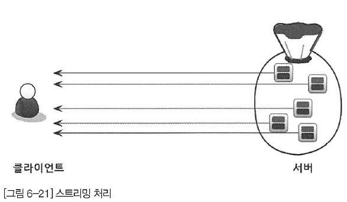
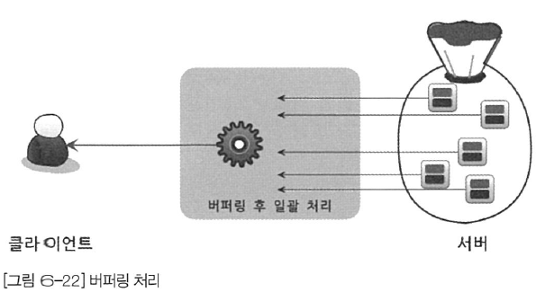

# 9. 옵티마이저와 인덱스

- 옵티마이저: 쿼리를 최적으로 실행하기 위해, 실행 계획을 수립하는 녀석

## 9.1 개요

### 9.1.1 쿼리 실행절차

- MySQL 서버에서 **쿼리가 실행되는 절차**는 크게 세 단계로 나뉜다.
  - 쿼리를 MySQL 서버가 이해할 수 있도록 **파싱**한다.
  - 파싱된 정보로 **어떤 테이블부터 읽고 어떤 인덱스를 이용해 테이블을 읽을지** 선택한다. (옵티마이저)
    - 불필요한 조건 제거 & 복잡한 연산 단순화
    - 테이블 조인이 있는 경우 어떤 순서로 읽을지 결정
    - 조건절과 인덱스 정보를 이용해 어떤 인덱스를 사용할지 결정
    - 읽어온 레코드들을 임시 테이블에 넣고 다시 한번 가공할지 결정
  - 수립된 계획으로 스토리지 엔진으로부터 데이터를 가져온다.

### 9.1.2 옵티마이저 종류

- 현재의 DBMS가 선택하는 **비용기반 최적화**(CBO), 과거의 **규칙기반 최적화**(RBO)로 나뉜다.
  - **규칙기반 최적화**는 테이블의 레코드 건수나 카디널리티 등을 고려하지 않고 옵티마이저에 내장된
    우선 순위에 따라 실행 계획을 수립, 현재는 사용되지 않는다.
  - **비용기반 최적화**는 쿼리를 처리하기 위한 여러가지 방법을 만들고, 각 작업의 부하와 통계 정보를 이용해
    여러 방법의 비용을 산출한다. 그 후 비용이 최소로 소요되는 방식을 택한다.

## 9.2 기본 데이터 처리

- 모든 RDBMS는 데이터를 정렬 & 그루핑 하는 가공 기능을 가지고 있지만, 그 과정은 다양하다.

### 9.2.1 풀 테이블 스캔과 풀 인덱스 스캔

- **풀 테이블 스캔**은 인덱스 없이 데이터를 처음부터 끝까지 읽는 방식으로, MySQL 옵티마이저는
  아래의 조건이 일치할 때 주로 풀 테이블 스캔한다.
  - 테이블 레코드 건수가 너무 작아서, 풀 테이블 스캔하는게 빠를 경우 (페이지 1개로 구성된 경우)
  - WHERE / ON 절에서 인덱스를 이용할 수 있는 조건이 없는 경우
  - 인덱스 레인지 스캔을 타더라도 조건 일치 레코드 건수가 너무 많은 경우
- 테이블을 처음부터 끝까지 읽는 작업은 많은 I/O를 소모하기에, 각 DBMS는 페이지 단위로 읽어오는 기능을 내장한다.
  - MySQL은 풀 테이블 스캔시, 몇 개씩 페이지를 읽어올지 설정하는 시스템 변수가 X (사람들이 디스크에서 페이지를 하나씩 읽는다고 생각함)
    - MyISAM 에선 맞지만 InnoDB는 틀리다.
    - InnoDB는 **한 테이블의 연속된 페이지가 읽히면**, `백그라운드 스레드`가 미리 데이터를 읽어 InnoDB 버퍼 풀에 적재한다. **(리드 어헤드)**
    - 즉, **풀 테이블 스캔**이 실행되면 처음 몇 개의 페이지는 `포그라운드 스레드`가 실행하지만, 특정 시점부터 읽기 작업을 `백그라운드 스레드`가 담당한다.
    - 이 방법을 통해 `포그라운드 스레드`는 버퍼 풀에 준비된 데이터를 가져가면 되기에 쿼리가 빠르게 처리된다.
- MySQL 서버는 `innodb_read_ahead_threshold` 시스템 변수를 이용해 리드 어헤드 임계값을 설정할 수 있다.
  - 디폴트 설정으로 충분하지만 데이터 웨어하우스 용으로 MySQL을 사용한다면 임계값을 낮춰 빨리 리드 어헤드가 시작되도록 유도하자.
- 리드 어헤드는 풀 인덱스 스캔에서도 사용된다. 풀인덱스 스캔은 인덱스를 처음부터 끝까지 스캔하는 것을 의미한다.
  - `select count(*) from employees;`
    - 이 쿼리는 조건 없이 레코드 건수를 조회하는데 상대적으로 용량이 적은 인덱스를 선택해 **풀 인덱스 스캔**이 발생할 확률이 높다.
    - 일반적으로 인덱스 테이블은 2-3개 컬럼으로 구성되기에 테이블 자체보다는 용량이 적어 훨씬 빠른 처리가 가능하다.
  - `select * from employees;`
    - 이 쿼리는 컬럼이 필요하므로 풀 테이블 스캔이 발생한다.
  - `select id or 다른인덱스 from employees;`
    - 이 쿼리는 풀 인덱스 스캔이 발생

### 9.2.2 병렬 처리

- **병렬 처리**는 하나의 쿼리를 여러 스레드가 작업을 나누어 동시에 처리한다.
  - `innodb_parallel_read_thread` 시스템 변수로 몇 개의 스레드를 이용할지 결정할 수 있다.
- MySQL 8.0 버전에서는 아무런 where 조건 없이 단순히 **테이블 전체 쿼리를 가져오는 쿼리**만 병렬로 처리된다.
  - `select count(*) from users;`

```sql
mysql> SET SESSION innodb_parallel_read_threads=1;
mysql> SELECT COUNT(*) FROM users;
1 row in set (0.32 sec)

mysql> SET SESSION innodb_parallel_read_threads=2;
mysql> SELECT COUNT(*) FROM users;
1 row in set (0.20 sec)

mysql> SET SESSION innodb_parallel_read_threads=4;
mysql> SELECT COUNT(*) FROM users;
1 row in set (0.18 sec)

mysql> SET SESSION innodb_parallel_read_threads=8;
mysql> SELECT COUNT(*) FROM users;
1 row in set (0.13 sec)
```

### 9.2.3 Order By 처리

- 정렬을 처리하기 위해 `인덱스를 이용하는 방법`과 `FileSort` 라는 별도의 처리를 이용할 수 있다.
  - **인덱스를 이용한다면?**
    - 인덱스가 정렬돼어 있어서 순서대로 읽기만 하니까 매우 빠르다.
    - 인덱스 때문에 디스크 공간 & InnoDB 버퍼풀을 위한 메모리가 많이 필요하다.
  - **FileSort를 이용한다면?**
    - 인덱스의 단점이 장점으로 적용, 레코드가 적다면 메모리에서 filesort가 처리되므로 충분히 빠르다.
    - 쿼리 실행시에 정렬이 처리되므로, 레코드 건수가 많을수록 느리다.
- 현실적으로 **모든 정렬을 인덱스를 이용하도록 튜닝**하는건 불가능
  - 정렬 기준이 너무 많아, 모두 인덱스를 생성하는게 불가능
  - Group By, distinct 처리의 결과를 정렬해야 하는 경우
  - UNION 같은 임시 테이블의 결과를 정렬해야 하는 경우
  - 랜덤하게 결과 레코드를 가져오는 경우
- MySQL 서버에서 별도의 정렬 처리를 수행했는지는, 실행계획의 `Extra 칼럼에 Using filesort`로 판단할 수 있다.
- 그렇다면 MySQL의 정렬이 어떻게 처리되는지 살펴보자.

#### 9.2.3.1 소트 버퍼 (Sort Buffer)

- MySQL은 **정렬을 위해 별도의 메모리 공간을 할당**받는데, 이 메모리 공간을 `소트 버퍼`라고 한다.
  - 이 버퍼는 **정렬이 필요한 경우에만** 할당된다.
  - 버퍼의 크기는 정렬해야 하는 레코드 크기에 따라 가변적으로 변하지만, 최대 사용가능한 공간은 `sort_buffer_size`로 설정한다.
  - 소프 버퍼를 위한 메모리 공간은 쿼리 실행이 완료되면 즉시 해제된다.
- 만약 정렬해야 할 레코드 건수가 **할당된 공간보다 크다면** 어떻게 될까?
  - 레코드를 여러 조각으로 나눈 뒤, 한 레코드에 대해 소트 버퍼에서 정렬을 수행하고, 그 결과를 디스크에 임시로 저장한다. 그리고 다음 레코드를 가져와 반복한다.
  - 위처럼 각 버퍼 크기만큼 정렬된 레코드를 다시 병합하면서 정렬해야 하는데 이를 `멀티 머지`라고 부른다.
    - 수행된 멀티 머지 횟수는 `Sort_merge_passes` 라는 상태변수로 확인할 수 있다.
  - 이 작업들은 모두 디스크 I/O를 유발하며 레코드 건수가 많을수록 반복 횟수가 많아진다.
- 소트 버퍼를 크게 설정하면 메모리에서만 처리되므로 더 빨라질 것 같지만 큰 차이를 보이진 않았다.
  - 256KB ~ 8MB 사이에서 최적의 성능을 보였으며, 그 외에 구간에서는 성능 효과가 없었다.
- 저자의 경험을 기반으로 소트 버퍼 크기는 56KB ~ 1MB 미만이 좋아보인다고 함
  - 소트 버퍼는 공유할 수 있는 메모리가 아니라서, **소트 버퍼크기가 너무 크다면** 트래픽이 많을떄 OOM 현상에 의해 강제종료 될 수 있다.

#### 9.2.3.2 정렬 알고리즘

- 정렬할 때 **레코드 전체**를 `소트 버퍼`에 담을건지, **정렬 기준 컬럼만** 담을건지에 따라 싱글패스, 투 패스 2가지 정렬 모드가 있다.
  - 둘 중에 어떤 정렬을 하는지는 옵티마이저 트레이스 기능으로 확인할 수 있다.
  ```
  mysql> SET OPTIMIZER_TRACE="enabled=on", END_MARKERS_IN_JSON="on";
  mysql> SET OPTIMIZER_TRACE_MAX_MEM_SIZE=1000000;

  ```
- MySQL 정렬 방식은 아래와 같이 3가지 방식이 있다.
  - **<sort_key, row_id>**: 정렬 키와 레코드 id만 가져와서 정렬 (투 패스)
  - **<sort_key, record>**: 정렬 키와 레코드 전체를 가져와서 정렬, 레코드의 칼럼은 고정사이즈로 메모리에 저장 (싱글패스)
  - **<sort_key, packed_record>**: 정렬 키와 레코드 전체를 가져와서 정렬, 레코드의 칼럼은 가변사이즈로 메모리에 저장 (싱글패스)

##### 9.2.3.2.1 싱글패스 정렬방식

- 처음 테이블을 읽을 때 정렬에 필요없는 컬럼도 소트버퍼에 담고 정렬을 수행한다.
- 정렬이 완료되면 버퍼 내용을 그대로 전달한다.

##### 9.2.3.2.2 투 패스 정렬방식

- **정렬 대상 컬럼과 PK만** 소트 버퍼에 담아 정렬을 수행하고, 정렬된 순서대로 필요한 컬럼을 select해서 가져온다.
- 최신 버전에서는 일반적으로 `싱글패스 방법`을 사용하지만, 아래의 경우 MySQL 서버는 싱글패스 정렬을 사용하지 못하고 투패스를 사용한다.
  - 레코드의 크기가 `max_length_for_sort_data` 설정보다 큰 경우
  - `BLOB이나 TEXT` 타입의 컬럼이 select 대상에 포함될 떄
- `싱글패스 방식은` 레코드의 크기나 건수가 작은 경우 빠르며, `투 패스 방식은` 레코드의 크기나 건수가 크다면 효율적이다.
- select 쿼리에서 필요한 컬럼을 조회하지 않고 * 를 쓰면 이는 정렬 버퍼에서 몇배, 몇십배까지 비효율적으로 사용될 가능성이 크다

#### 9.2.3.3 정렬 처리방법

- 쿼리에 ORDER BY가 들어가면 무조건 아래 **3가지 방법 중 하나로 정렬**이 처리된다.
  ```text
    정렬처리 방법                           | 실행계획의 Extra 컬럼내용

    인덱스를 사용한 정렬                      | 실행계획에서 별도 표기 없음
    조인에서 드라이빙 테이블만 정렬              | 실행계획에서 Using filesort 표시됨
    조인에서 조인결과를 임시 테이블로 저장 후 정렬  | 실행계획에서 Using temporary; Using filesort 메시지가 표시됨
  ```
  - 옵티마이저는 우선 인덱스를 이용할 수 있는지 검토한다.
    - **이용할 수 있다면** 인덱스를 순서대로 읽어서 결과를 반환한다.
    - **이용할 수 없다면** `filesort를` 이용하는데 이 때, 정렬 레코드를 최소화하기 위해 2가지 방법 중 하나를 택한다.
      - 조인의 드라이빙 테이블만 정렬한 다음 조인을 수행 (효율적임)
      - 조인이 끝나고 일치하는 레코드를 모두 가져온 후 정렬을 수행
- explain 예시

  ```sql
    explain select id from users order by id;
    -- Extra: Using index (커버링 인덱스)

    explain select password from users order by id;
    -- Extra: 안뜸 (인덱스를 통해 정렬되었다.)

    explain select id from users order by password;
    -- Extra: Using filesort (FileSort 사용)

    explain select id from users where id > 1 order by id;
    -- Extra: Using where; Using index

    explain select id from users where id > 1 order by password;
    -- Extra: Using where; Using filesort

    explain SELECT u.id FROM users u INNER JOIN reviews r ON u.id = r.userId ORDER BY u.id;
    -- Extra: Using index
    -- Extra: Using index

    explain SELECT u.id FROM users u INNER JOIN reviews r ON u.id = r.userId WHERE u.createdAt > '2023-01-01' ORDER BY u.id;
    -- Extra: Using where
    -- Extra: Using index

    explain SELECT u.id FROM users u INNER JOIN reviews r ON u.id = r.userId WHERE r.score > 3 ORDER BY u.id;
    -- Extra: Using where; Using temporary; Using filesort
    -- Extra: Using index

  ```

##### 9.2.3.3.1 인덱스를 이용한 정렬

- 인덱스를 정렬을 이용하려면 어떤 조건이 필요할까?
  - ORDER BY에 명시된 컬럼이 드라이빙 테이블에 속하고, ORDER BY 순서대로 인덱스가 있어야 한다.
  - where 절에 드라이빙 테이블에 대한 조건이 있다면, 그 조건과 order by는 같은 인덱스를 타야 한다.
- B-Tree 인덱스가 아닌 `해시 인덱스나, 전문 검색 인덱스, R-Tree 인덱스`는 인덱스를 이용한 정렬을 할 수 없다.
- 인덱스를 이용해 정렬되는 경우, 인덱스의 순서대로 읽기만 하면된다.

```sql
select *
from users u, salary s
where u.id = s.userId AND u.id between 1 AND 100000
order by u.id;
-- 인덱스가 자동 정렬되니 order by를 뺴는 것은 좋지 않다.
```

##### 9.2.3.3.2 조인의 드라이빙 테이블만 정렬

- 일반적으로 조인이 수행되면 레코드의 건수가 늘어나고, 레코드 하나의 크기도 커진다.
  - 따라서 조인을 하기 전에, **첫 번째 테이블의 레코드를 정렬한 다음** 조인을 실행하는게 베스트다.
- 이 방법으로 정렬을 처리하려면 조인에서 첫 번째로 읽히는 테이블(드라이빙 테이블)의 칼럼만으로 ORDER BY를 작성해야 한다.

```sql
select *
from users u, salary s
where u.id = s.userId AND u.id between 1 AND 100000
order by u.lastname;
```

- where 절이 2가지 조건을 가지고 있으므로 `옵티마이저는` users 테이블을 드라이빙 테이블로 선택한다.
  - where 절의 검색조건은 users 테이블의 PK를 이용해 작업량을 줄일 수 있다.
  - 드리븐 테이블 (salary)의 조인 컬럼인 userId가 인덱스에 있다.
- 검색 자체는 인덱스 레인지 스캔으로 처리 가능하지만, ORDER BY절은 users 테이블의 PK랑 상관없어서 인덱스를 이용한 정렬은 불가능하다.
  - ORDER BY 정렬 칼럼이 드라이빙 테이블에 속해있다.
  - 따라서 옵티마이저는 드라이빙 테이블만 검색해 정렬을 수행하고 그 결과를 salary 테이블과 조인한다.
- **전체적인 과정**을 정리하자.
  - 인덱스를 이용해 id가 1 AND 100000 조건을 만족하는 레코드를 검색
  - 검색 결과를 lastname으로 filesort를 이용해 정렬
  - 정렬된 결과를 순서대로 salary 테이블과 조인해 최종결과를 가져온다.

##### 9.2.3.3.3 임시 테이블을 이용한 정렬

- 여러 테이블을 조인해서 결과를 정렬한다면 그 과정에서 임시 테이블이 필요할 수도 있다.

```sql
select *
from users u, salary s
where u.id = s.userId AND u.id between 1 AND 100000
order by s.amount;
```

- 쿼리에서 ORDER BY의 **정렬 기준 컬럼**이 `드리븐 테이블`에 있다. 즉 정렬이 수행되기 전에 salary 테이블을 읽어야 하므로
이 쿼리는 조인된 데이터를 가지고 정렬할 수 밖에 없다.

##### 9.2.3.3.4 정렬 처리 방법의 성능비교

- 쿼리에서 인덱스를 사용하지 못하는 정렬이나 그룹핑 작업이 왜 느리게 작동하는지 살펴보자.

###### 9.2.3.3.4.1 스트리밍 방식


- 조건에 일치하는 **레코드가 검색될때마다 바로 클라이언트로 전송**해주는 방식으로, 얼마나 많은 레코드를 조회하느냐에 상관없이 빠른 응답 시간을 보장한다.
- LIMIT 처럼 건수를 제한하는 조건들은 풀테이블 스캔과 같은 쿼리의 처리시간을 상당히 줄여준다.
- JDBC 같은 라이브러리로 `select * from bigtable` 같은 쿼리를 실행하면 MySQL은 스트리밍 방식으로 동작하지만 JDBC가 모든 결과를 전달받으면 클라이언트에게 전달한다.
  - JDBC가 자체적으로 버퍼링 하는 이유는 전체처리 시간이 짧고 MySQL 서버와의 통신 횟수가 줄기 떄문이다.

###### 9.2.3.3.4.2 버퍼링 방식


- `order by, group by` 처리는 쿼리의 결과가 스트리밍되는 것을 불가능하게 한다.
  - where 조건에 일치하는 레코드를 모두 가져온 후, 정렬하거나 그루핑해서 차례대로 보내야 하기 때문.
- MySQL 서버에서 모든 레코드를 검색하고 정렬 작업을 하는 동안 클라이언트는 아무것도 하지 않고 기다려야 하기 때문에 응답속도가 느리다.
- LIMIT을 통한 성능 향상에 별로 도움이 되지 않는다.
  - **인덱스를 사용한 정렬방식**은 LIMIT 제한 건수만큼 읽으면서 스트리밍 방식으로 동작할 수 있지만, **인덱스를 사용하지 못한 경우** 디스크에서 레코드를 읽어서 정렬한 후에야 LIMIT이 적용된다.
- 어느 테이블이 먼저 드라이빙되어 조인되는지도 중요하지만, **어떤 정렬방식으로 처리되는지는 더 큰 성능 차이**를 만든다.
  - **가능하다면 인덱스를 사용한 정렬**로 유도하고, 최소한 드라이빙 테이블만 정렬해도 되는 수준으로 튜닝하는 것이 좋다.

#### 9.2.3.4 정렬 관련 상태 변수

- MySQL 서버는 주요 작업의 실행 횟수를 상태 변수로 저장한다.

```sql
mysql> FLUSH STATUS;
mysql> SHOW STATUS LIKE 'Sort%';

Variable_name      value   의미
Sort_merge_passes  13      멀티 머지 처리 횟수
Sort_range         0       인덱스 레인지 스캔을 통해 검색된 결과를 정렬한 횟수
Sort_rows          300024  현재까지 정렬한 전체 레코드 건수
Sort_scan          1       풀 테이블 스캔을 통해 검색된 결과에 대한 정렬 횟수

해석하자면 인덱스 없이 풀 테이블 스캔이 발생했고 13번의 병합 정렬이 발생, 정렬된 총 레코드 건수는 300024 개였다.
```

### 9.2.4 Group By 처리

- Group By 쿼리도 스트리밍된 처리를 할 수 없게 하는 기능이다.
  - Group By에 사용된 조건은 인덱스를 사용해서 처리할 수 없으므로 HAVING 절을 튜닝하려고 고민할 필요는 없다.
- **Group By가 인덱스를 사용할 때는** 인덱스를 차례로 읽는 인덱스 스캔, 인덱스를 건너뛰면서 읽는 루스 인덱스 스캔 방법을 사용한다.
- **Group By가 인덱스를 사용하지 못할 때는** 임시 테이블을 사용한다.

#### 9.2.4.1 인덱스 스캔을 이용하는 GROUP BY

- 조인시, 드라이빙 테이블에 속한 컬럼만 이용해 그루핑할 때 그 칼럼에 인덱스가 있다면, 그 인덱스를 차례대로 읽으면서
그루핑 작업을 수행하고 그 결과로 조인을 처리한다.
- **Group By가 인덱스를 타더라도** 그룹 함수 등의 그룹값을 처리해야 해서 **임시 테이블이 필요할 때도** 있다.
- 쿼리 실행 계획 Extra 컬럼에서 별도로 Using Index for `group-by나 Using temporary, Using filesort가` 표시되지 않는다.

#### 9.2.4.2 루스 인덱스 스캔을 이용하는 Group By

- 인덱스의 레코드를 건너뛰면서 필요한 부분만 읽어서 가져오는 것을 의미한다.
- Extra 컬럼에 Using Index for group-by가 표기된다.

```sql
EXPLAIN SELECT emp_no FROM salary WHERE from_date = '1985-03-01' GROUP BY emp_no;
```

- **인덱스가 (emp_no, from_date)** 로 생성돼 있을 때, WHERE 절은 인덱스 레인지 스캔 방식을 이용할 수 없는 쿼리다.
- 하지만 쿼리 **실행 계획을 보면 인덱스 레인지 스캔**을 이용하게 되는데 MySQL 서버가 어떻게 실행했는지 살펴보자
  - (emp_no, from_date) 인덱스를 스캔하면서 emp_no 첫 번째 유일값 '10001'을 찾는다.
  - 인덱스에서 emp_no가 '10001' 이면서 from_date 값이 '1985-03-01' 조건을 합쳐서 인덱스를 검색한다.
  - (emp_no, from_date) 인덱스에서 emp_no의 다음 유니크한 값을 가져와 반복한다.
- MySQL **루스 인덱스 스캔 방식**은 단일 테이블의 GROUP BY 처리에만 사용될 수 있다.
  - **인덱스 레인지 스캔**은 유니크한 값의 수가 많을수록 성능이 향상된다.
  - **인덱스 루스 스캔**에서는 인덱스의 유니크한 값의 수가 적을수록 성능이 향상된다.
- 루스 인덱스 스캔을 사용할 수 있는 쿼리

```sql
SELECT col1, col2 FROM test GROUP BY col1, col2;           -- Using index; Using filesort / Using temporary; Using filesort
SELECT MIN(col1), MAX(col2) FROM test GROUP BY col1, col2; -- Using index; Using temporary; Using filesort
SELECT col1, col2 FROM test WHERE col3 = 'col3' GROUP BY col1, col2;
```

- 루스 인덱스 스캔을 사용할 수 없는 쿼리패턴
```sql
-- MIN(), MAX() 외의 집함 함수가 사용되어서 루스 인덱스 스캔 사용불가
SELECCT col1, SUM(col2) from test GROUP BY col1;

-- GROUP BY에 사용된 컬럼이 인덱스와 일치하지 않아서 루스 인덱스 스캔 사용불가
SELECCT col1, col2 from test GROUP BY col2, col3;

-- SELECT 컬럼이 GROUP BY와 일치하지 않아서 루스 인덱스 스캔 사용불가
SELECCT col1, col3 from test GROUP BY col1, col2;
```

#### 9.2.4.3 임시 테이블을 사용하는 GROUP BY

- GROUP BY 기준 컬럼이 인덱스를 전혀 사용하지 못할 때 사용된다.

```sql
EXPLAIN SELECT e.last_name, AVG(s.salary) FROM
employees e, salary s
WHERE s.emp_no = e.emp_no GROUP BY e.last_name;
```

- 이 쿼리에 실행계획 Extra 컬럼에는 `Using Temporary`가 표시된다. 그 이유는 풀 테이블 스캔이 아니라 인덱스를 전혀 사용할 수
없는 GROUP BY이기 때문이다.
- **MySQL 8.0 이전 버전에서는** Group By가 사용된 쿼리는, 그루핑된 컬럼을 기준으로 **묵시적인 정렬도** 함께 수행했다.
  - 정렬이 필요하지 않다면 ORDER BY NULL을 사용할 것을 권장
- **MySQL 8.0 이후 버전부터는** 묵시적 정렬은 수행되지 않고 ORDER BY 키워드를 이용한 **명시적인 정렬작업만** 수행한다.
  - 굳이 ORDER BY NULL을 사용할 필요가 없음

### 9.2.5 DISTINCT 처리

- 특정 컬럼의 유니크한 값만 조회하기 위해 사용되는데, MIN, MAX 같은 집함함수가 쓰이냐에 따라 영향이 달라진다.
- DISTINCT 처리가 **인덱스를 사용하지 못하게 되면 항상 임시 테이블이 필요**하고, Extra 컬럼에는 Using Temporary 메시지가
출력되지 않는다.

#### 9.2.5.1 SELECT DISTINCT

- 단순히 `SELECT distinct(city) FROM users` 와 같이 집함이 쓰이지 않는다면 GROUP BY와 동일한 방식으로 처리된다.
- DISINCT는 레코드를 유니크하게 가져오는 것이지, 특정 컬럼만 유니크하게 조회하지 않는다.
  - `SELECT DISTINCT fist_name, last_name FROM users`
  - `SELECT DISTINCT(fist_name), last_name FROM users`

#### 9.2.5.2 집합 함수와 함께 사용된 DISTINCT

- COUNT, MIN 등의 집함 함수와 DISTINCT 키워드가 사용되면, 위 형태와는 다르게 동작한다.
  - 집합 함수 내에서 사용된 DISTINCT는 그 집합 함수의 인자로 전달된 컬럼값이 유니크한 것들을 가져온다.

```sql
EXPLAIN SELECT COUNT(DISTINCT s.salary)
FROM employees e, salary s
WHERE s.emp_no = e.emp_no;
```

- 위 쿼리는 내부적으로 임시 테이블을 사용하지만 실행 계획에서는 표시되지 않는다.
  - 이 때 만들어진 임시 테이블의 salary 컬럼에는 유니크 인덱스가 생성되어 레코드 건수가 많다면 상당히 느려질 수 있다.
- 아래와 같이 쿼리에 `COUNT(DISTINCT)`를 하나 더 추가하면 2개의 임시 테이블을 사용하게 된다.

```sql
EXPLAIN SELECT COUNT(DISTINCT s.salary), COUNT(e.last_name)
FROM employees e, salary s
WHERE s.emp_no = e.emp_no;
```

- 만약 **DISTINCT 처리가 인덱스를 탄다면** 인덱스 풀 스캔 or 레인지 스캔하면서 임시 테이블 없이 최적화된 처리를 수행할 수 있다.
  - `SELECT COUNT(DISTINCT emp_no) FROM employees`
- DISTINCT가 집합 함수 없이 사용된 경우와 아닌 경우의 차이를 정확히 알자.

```sql
SELECT DISTINCT fist_name, last_name
FROM employees;

SELECT COUNT(DISTINCT fist_name), COUNT(last_name)
FROM employees;

SELECT COUNT(DISTINCT fist_name, last_name)
FROM employees;
```

### 9.2.6 내부 임시 테이블 활용

- MySQL 엔진이 스토리지 엔진으로 얻어온 데이터를 `정렬 / 그루핑` 할 때는 **내부적으로 임시 테이블**을 사용한다.
  - 여기서 내부적 이란 말은 `CREATE TEMP TABLE` 명령으로 만든 테이블이 아니다.
- 일반적으로 MySQL 엔진이 사용하는 임시 테이블은 **처음에는 메모리에 생성됐다가** 테이블의 크기가 커지면 디스크로 옮겨진다.
- 쿼리의 처리가 완료되면 임시 테이블은 삭제된다.

#### 9.2.6.1 메모리/디스크 임시 테이블

- **MySQL 8.0 이전 까지는**, 임시 테이블이 메모리를 사용하면 MEMORY 스토리지 엔진, 디스크는 MyISAM 스토리지 엔진을 이용한다.
- **MySQL 8.0 버전 부터**, 메모리는 `TempTable 스토리지 엔진`을 사용하고 디스크는 `InnoDB 스토리지 엔진`을 사용하도록 개선됐다.
- 기존 MEMORY 스토리지 엔진은 **가변길이 타입(varchar)을 지원하지 못해** 메모리 낭비가 심했고 MyISAM 스토리지 엔진은 **트랜잭션을 지원하지 못한다는 단점**이 있었다.
  - 바꿔 말해 TempTable 스토리지 엔진은 가변길이 타입을 지원하며 InnoDB는 트랜잭션을 지원한다.
- `internal_tmp_mem_storage_engine` 시스템 변수를 이용해 메모리 임시 테이블 엔진을 선택할 수 있는데 기본값은 `TempTable`이다.
- `TempTable`이 최대한 사용가능한 메모리 공간 크기는 temptable_max_ram 시스템 변수로 제어 가능한데 기본 값은 1GB이다.
  - 만약 임시 테이블이 1GB 보다 커지면 MySQL은 **2가지 디스크 저장 방식**을 택한다.
    - MMAP 파일로 디스크에 기록 (디폴트 방식으로 오버헤드가 적다)
    - InnoDB 테이블로 기록

#### 9.2.6.2 임시 테이블이 필요한 쿼리

- 아래 쿼리는 MySQL 엔진에서 **별도의 데이터 가공 작업**이 필요하기 때문에 임시 테이블을 생성하는 케이스다. 또한 **인덱스를 사용하지
못할 때** 내부 임시 테이블을 생성해야 할 때가 많다.
  1. ORDER BY, GROUP BY에 **명시된 컬럼이 다른 쿼리**
  2. ORDER BY, GROUP BY에 **명시된 컬럼이 조인의 순서상 첫 번째 테이블이 아닌 쿼리**
  3. DISTINCT와 ORDER BY가 동시에 쿼리에 존재하는 경우 or DISTINCT가 인덱스를 타지 못하는 쿼리
  4. UNION이 사용된 쿼리
  5. 쿼리의 실행 계획에서 select_type이 DERIVED인 쿼리
- 임시 테이블을 사용하는지 확인하는 방법은 Extra 컬럼이 Using temporary인 경우다.
- Using temporary가 아니어도 임시 테이블을 사용할 수 있는데, `1-3번 쿼리`가 그에 해당한다.
- `1-4번 쿼리`는 **내부적으로 유니크 인덱스를 사용**하며 5번의 경우 유니크 인덱스가 없는 임시 테이블이 사용된다.
  - 유니크 인덱스가 사용되면 처리 성능이 상당히 느리다.

#### 9.2.6.3 임시 테이블이 디스크에 생성되는 경우

- **UNION, UNION ALL** 쿼리에서 SELECT 되는 컬럼의 길이가 512 바이트 이상인 경우
- **GROUP BY, DISTINCT** 컬럼의 크기가 512 바이트 이상인 경우
- **메모리 임시 테이블의 크기가** 각 메모리 엔진(MEMORY, TempTable)의 임시테이블 최대크기 시스템 변수 보다 큰 경우

#### 9.2.6.4 임시 테이블 관련 상태 변수

- 실행 계획을 통해서는 임시 테이블이 메모리 혹은 디스크에서 처리된건지 알 수 없다.
- 이를 위해 아래 명령어로 확인할 수 있다.
- `SHOW SESSION STATUS LIKE 'Created_tmp%'`

```text
Variable name            value description
Created_tmp_disk_tables  1      디스크에 생성된 임시 테이블 개수를 누적한다.
Created_tmp_tables       1      메모리 or 디스크에 생성된 임시 테이블 개수를 모두 누적한다.
```

## 9.3 고급 최적화

### 9.3.1 옵티마이저 스위치 옵션

- MySQL 5.5 버전부터 지원되기 시작했는데, 고급 최적화기능들을 활성화할지를 제어하는 용도로 사용된다.
- **MRR(Multi-Range Read)과 배치키 엑세스**
  - MySQL에서 드라이빙 테이블의 레코드를 한 건 읽어서 드리븐 테이블 레코드와 조인하는 것을 네스티드 루프 조인이라고 한다.
- **블록 네스티드 루프 조인 (Block nested loop)**
  - 네스티드 루프 조인과 차이는 조인버퍼가 사용되는지 여부와 조인에서 드라이빙/드리븐 테이블이 어떤 순서로 조인되느냐다.
  - 조인은 드라이빙 테이블에서 일치하는 레코드 건수만큼 드리븐 테이블을 검색하면서 처리된다.
    - 즉 드라이빙 테이블은 한 번에 쭉 읽지만 드리븐 테이블은 여러 번 읽는다는 것을 의미
    - 예를 들어 드라이빙 테이블의 레코드가 1000건인데, 조인에 인덱스를 이용할 수 없다면 드리빙 테이블을 1000번의 풀 테이블 스캔을 해야 한다.
    - 따라서 옵티마이저는 최대한 드리븐 테이블 조인을 위한 검색시 인덱스를 사용할 수 있도록 계획을 수립한다.
  - MySQL 8.0.20 버전부터 블록 네스티드 루프조인은 해시 조인 알고리즘으로 대체되어 사용된다.
- **인덱스 컨디션 푸시다운**
  - 특정 형태의 쿼리에서 인덱스를 좀 더 효율적으로 사용할 수 있는 기능으로 쿼리의 성능이 몇 배에서 몇 십배까지 향상될 수 있다.
- **인덱스 확장 (use_index_extensions)**
  - InnoDB 스토리지 엔진에서 모든 세컨더리 인덱스는 리프 노드에 PK를 저장한다.
  - 따라서 PK가 (A, B) 이고 세컨더리 인덱스가 C 라면, C의 리프노드는 PK를 가리키기 때문에 상황에 따라 필요하다면 아래와 같은 형태의 인덱스로 동작할 수 있도록 한다. (C, A, B)
- **인덱스 머지**
  - 인덱스를 이용해 쿼리를 실행하면, 옵티마이저는 하나의 인덱스만 사용하도록 실행 계획을 수립한다.
  - 인덱스 머지 실행 계획을 사용하면 하나의 테이블에 대해 2개 이상의 인덱스를 이용해 쿼리를 처리한다.
  - 옵티마이저는 하나의 인덱스만 사용해서 범위를 줄일 수 있다면 하나의 인덱스만 사용하는게 효율적이다.
    - 하지만 쿼리의 각 조건이 서로 다른 인덱스를 사용할 수 있고, 그 조건을 만족하는 레코드 건수가 많을 것으로 예상되면 인덱스 머지 실행 계획을 택한다.
  - 인덱스 머지 실행 계획은 아래 3개의 세부 계획으로 구분할 수 있다.
    - `index_merge_intersection`
      - Extra: Using intersect, 여러 개의 인덱스를 각각 검색해 교집합만 반환
    - `index_merge_sort_union`
      - Extra: Using union, 여러 개의 인덱스 결과를 Union 알고리즘으로 병합
    - `index_merge_union`
      - Extra: Using sort_union, 인덱스 머지 작업시에 정렬이 필요한 경우 사용
- **세미조인**
  - 다른 테이블과 실제 조인하지 않고, 다른 테이블에서 조건에 일치하는 레코드가 유무를 체크하는 형태의 쿼리를 세미조인이라 한다. (서브쿼리를 쓰는 쿼리형태)
    - MySQL 5.x 에서는 서브쿼리 최적화가 취약했으나 8.0 버전부터 세미조인 쿼리 성능을 위해 최적화 전략이 있다.
      - Table Pull-out
      - Duplicate Weed-out
      - First Match
      - Loose Scan
      - Materialization
    - 쿼리에 따라 MySQL은 사용 가능한 전략들을 선별적으로 사용한다.
      - Table Pull-out은 항상 세미 조인보다 좋은 성능을 내기에 별도의 제어 옵션은 없다.
      - First Match, Loose Scan 최적화 전략은 옵티마이저 옵션으로 사용여부를 결정할 수 있고
      - Duplicate Weed-out과 Materialization 최적화는 Materialization 옵티마이저 스위치로 사용여부를 결정한다.
- **컨디션 팬아웃**
  - 조인을 실행할 때 테이블의 순서는 쿼리 성능에 매우 큰 영향을 미친다.
    - 예를 들어 A 테이블에 10만건 B 테이블에 10건일 때 A를 드라이빙 테이블로 결정하면 B 테이블을 10만번 읽어야 한다.
  - 그래서 MySQL 옵티마이저는 여러 테이블이 조인되는 경우 일치하는 레코드 건수가 적은 순서대로 조인을 실행한다.
  - condition_fanout_filter 최적화 기능을 활성화하면 옵티마이저는 더 정교한 계산을 하느라 많은 시간과 컴퓨팅 자원을 소모한다.
    - 쿼리가 간단하고 MySQL 8.0 이전 버전에서도 쿼리 실행 계획이 잘못된 선택을 한 적이 없다면 이 최적화는 성능 향상에 크게 도움이 되지 않을 수도 있는 것을 염두하자.
- **해시 조인**
  - MySQL 8.0.18 버전부터 해시 조인이 도입되었고, 첫 번째 레코드를 찾는데 시간이 많이 걸리지만 최종 레코드를 찾는데 시간이 훨씬 단축된다. (네스티드 루프 조인에 비해)
  - 해시 조인은 최고 스루풋 전략에 적합하며, 네스티드 루프 조인은 최고 응답속도 전략에 적합하다는 것을 알 수 있다.
  - 일반적으로 웹 서비스는 온라인 트랙잭션 서비스이기 때문에 응답속도가 더 중요하다.
    - 이런 이유로 조인 조건 컬럼이 인덱스가 없거나, 특정 경우에만 해시 조인 알고리즘을 사용한다.
    - 즉 네스티드 루프 조인이 사용되기에 적합하지 않은 경우를 위한 차선책 같은 기능이라 생각하자.

### 9.3.2 조인 최적화 알고리즘

- **Exhaustive 검색 알고리즘**
  - MySQL 5.0과 그 이전 버전에서 사용되던 조인 최적화 기법으로 FROM 절에 명시된 모든 테이블의 조합에 대해 실행 계획의 비용을 계산해서 최적의 조합 1개를 찾는 방법
  - 따라서 조인되는 테이블이 늘어날수록 실행계획 수립에 시간이 걸리며 이전의 버전에서는 테이블이 10개만 넘어도 실행 계획을 수립하는데 몇 분이 걸린다.
- **Greedy 검색 알고리즘**
  - MySQL 5.0 버전부터 도입된 기법으로 복잡한 형태로 최적의 조인순서를 결정한다.
  - 검색 알고리즘을 여러번 읽어도 이해가 안되는데 굳이 적지말고, 추후에 필요하다면 보자.

## 9.4 쿼리 힌트

- 옵티마이저 최적화 방법들이 이전에 비해 많이 좋아졌지만 MySQL 서버는 우리의 비지니스를 100% 이해하지 못하기 때문에
  개발자나 DBA가 부족한 실행계획을 수립할 때가 있을 수 있다.
- 이 경우 옵티마이저에게 실행계획을 어떻게 수립해야 좋을지 알려줄 방법이 필요하다. 이런 목적으로 RDBMS는 힌트가 제공되며,
  MySQL에서도 크게 **2가지 힌트**가 제공된다.
  - 인덱스 힌트
  - 옵티마이저 힌트
- 인덱스 힌트는 예전부터 사용되오던 "USE INDEX" 같은 힌트를 의미하며, 옵티마이저 힌트는 MySQL 5.6 버전부터
새롭게 추가되기 시작한 힌트를 의미한다.

### 9.4.1 인덱스 힌트

- `STRAIGHT_JOIN, USE INDEX` 등을 포함한 인덱스 힌트는 MySQL 옵티마이저 힌트가 도입되기 전에 사용되던 기능들이다.
  - 모두 SQL의 문법에 맞게 사용하기 때문에 ANSI-SQL 문법을 준수하지 못하게 되는 단점이 있다.
  - 반면에 옵티마이저 힌트들은 다른 DBMS에서 주석으로 해석하기 때문에 ANSI-SQL 표준을 준수한다고 볼 수 있다.
  - 그래서 가능하다면 **인덱스 힌트보다는 옵티마이저 힌트**를 사용할 것을 추천한다.
- `STRAIGHT_JOIN`
  - 옵티마이저 힌트인 동시에 조인 키워드이다.
  - 3개의 테이블을 조인하는 쿼리가 있다면, 어느 테이블이 드라이빙이 되고 어느 테이블이 드리븐이 될지 알 수 없다. 옵티마이저가
  그때그때 가장 최적이라고 판단되는 순서로 조인한다.
  - 만약 쿼리의 조인 순서를 변경하려는 경우 STRAIGHT_JOIN 조인힌트를 줄 수 있다.
- `USE INDEX / FORCE INDEX / IGNORE INDEX`
  - 조인의 순서를 변경하는 것 다음으로 자주 사용되는 것이 인덱스 힌트인데, 보통 옵티마이저는 어떤 인덱스를 타야 하는지 무난하게
  잘 선택하는 편이다. 하지만 3-4개 이상의 컬럼을 포함하는 비슷한 인덱스가 여러개 존재하는 경우 옵티마이저도 실수를 하는데, 강제로
  특정 인덱스를 사용하도록 힌트를 추가한다.
  - 인덱스 힌트는 다음과 같이 3 종류가 있다.
    - `USE INDEX`: 옵티마이저에게 특정 테이블의 인덱스를 사용하도록 권장하는 힌트로 대부분 힌트를 채택하지만 항상 그 인덱스를 사용하진 않는다.
    - `FORCE INDEX`: USE INDEX 보다 강한 힌트로 실무에선 USE INDEX로 충분하다.
    - `IGNORE INDEX`: 특정인덱스를 사용하지 못하는 용도이다.

### 9.4.2 옵티마이저 힌트

- MySQL 8.0 버전에서 사용가능한 힌트는 종류가 매우 다양하며, 그 중 자주 사용되는 것들 위주로 살펴보자.
- 옵티마이저 힌트 종류
  - 인덱스: 특정 인덱스의 이름을 사용할 수 있는 옵티마이저 힌트
  - 테이블: 특정 테이블의 이름을 사용할 수 있는 옵티마이저 힌트
  - 쿼리블록: 특정 쿼리 블록에 사용할 수 있는 옵티마이저 힌트로, 힌트가 명시된 쿼리 블록에 대해서만 영향을 미침
    - SELECT 키워드로 시작하는 서브 쿼리 영역을 쿼리 블록이라고 한다.
  - 글로벌: 전체 쿼리에 영향을 미치는 힌트
- MAX_EXECUTION_TIME
  - 유일하게 쿼리의 실행 계획에 영향을 미치치 않는 힌트로 쿼리의 최대 실행시간을 설정하는 힌트이다.
  - 쿼리가 지정된 시간을 초과하면 다음과 같이 쿼리는 실패하게 된다.
- SET_VAR
  - 시스템 변수를 제어하여, 실행계획을 바꾸거나 조인/정렬 버퍼의 크기를 증가시켜 성능향상의 용도로 사용할 수 있다.
- SEMIJOIN & NO_SEMIJOIN
  - 세미조인의 최적화는 여러가지 세부 전략이 있다는 것을 9.3절에서 살펴봤고 SEMIJOIN 힌트는 어떤 세부 전략을 사용할지
    제어하는데 사용할 수 있다.
  - 최적화 전략 종류
    - Duplicate weed-out
    - First Match
    - Loose Scan
    - Materialization
    - Table Pull-out
- SUBQUERY
  - 서브쿼리 최적화는 세미조인 최적화가 사용되지 못할 때 사용하는 최적화 방법
  - 세미조인 최적화는 주로 IN 형태의 쿼리에 사용될 수 있지만 안티 세미조인의 최적화에는 사용할 수 없다.
  - 서브쿼리 최적화를 사용할 기회가 그다지 많지 않기에 자세한 예시는 생략한다고 저자가 말함
- JOIN_FIXED_ORDER & JOIN_ORDER & JOIN_PREFIX & JOIN_SUFFIX
  - MySQL 서버에서는 조인의 순서를 결정하기 위해 전통적으로 STRAIGHT_JOIN 힌트를 사용해왔다.
  - 하지만 STRAIGHT_JOIN 힌트는 쿼리의 FROM절에 사용된 테이블 순서를 조인 순서에 맞게 변경해야 하는 번거로움이 존재
  - 이런 단점을 보완하기 위해 옵티마이저 힌트에서는 4개의 힌트를 추가로 제공한다.
    - JOIN_FIXED_ORDER: STRAIGHT_JOIN와 동일
    - JOIN_ORDER: FROM 절에 명시된 순서가 아닌, 힌트에 명시된 테이블이 순서대로 조인을 실행
    - JOIN_PREFIX: 드라이빙 테이블만 강제하는 힌트
    - JOIN_SUFFIX: 드리븐 테이블만 강제하는 힌트
- MERGE & NO_MERGE
  - 예전의 MySQL 버전에서는 서브쿼리를 항상 내부 임시 테이블로 생성했다. 이렇게 생성된 내부 임시 테이블을
  파생 테이블 (Derived table) 이라고 하는데, 이는 불필요한 자원소모를 유발한다.
  - 그래서 MySQL 5.7과 8.0 버전에서는 가능하면 임시 테이블을 사용하지 않게 서브쿼리를 외부 쿼리와 병합하는 최적화를 도입했다
  - MySQL 옵티마이저가 이 두 방법중 최적의 방법을 선택하지 못할 수도 있는데 이떄는 MERGE 또는 NO_MERGE 힌트를 사용한다.
- INDEX MERGE & NO_INDEX_MERGE
  - 하나의 테이블에 대해 여러 개의 인덱스를 동시에 사용하는 것을 인덱스 머지라고 한다.
  - 인덱스 머지 실행 계획의 사용 여부를 제어할 때 INDEX MERGE 또는 NO_INDEX_MERGE 옵션을 이용한다.
- NO_ICP
  - 인덱스 컨디션 푸시다운 최적화는 사용이 가능하다면 항상 성능 향사에 도움이 되므로, 옵티마이저는 최대한 사용하는 방향으로 계획을 수립한다.
  - 그래서 인덱스 컨디션 푸시다운을 사용하도록 하는 힌트는 제공되지 않고 인덱스 컨디션 푸시다운으로 인해 실행비용 계산이 잘못된다면 비활성 용도로 사용할 수 있다.
- SKIP SCAN & NO_SKIP_SCAN
  - 옵티마이저가 비효율적인 인덱스 스킵 스캔을 선택하면 이를 사용하지 않게 설정할 수 있다.
- INDEX & NO_INDEX
  - 예전의 MySQL 서버에서 사용되던 인덱스 힌트를 대체하는 용도로 사용된다.