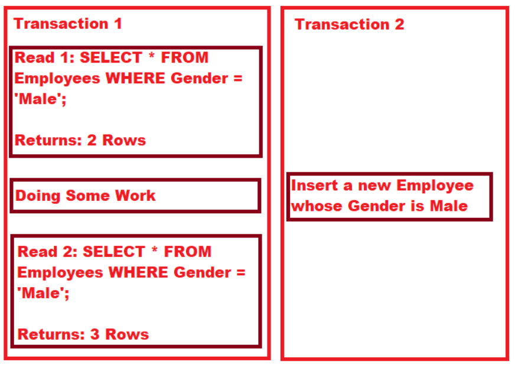

# Real MySQL 스터디 정리
- [Real MySQL 링크] (http://www.yes24.com/Product/Goods/103415627)
- 우테캠 JPA 스터디원 중 참석율이 높은 분들과 스터디
- 스터디 방식: 주마다 돌아가면서 정리한 내용 gather에서 발표

## 2장. 설치와 설정

### 2.3 MySQL 서버 업그레이드
- MySQL을 업그레이드 하는 방법에는 아래 **두 가지 방법**을 고려할 수 있다.
  - MySQL 서버 데이터 파일을 그대로 두고 업그레이드 하는 방법 (In-Place 업그레이드)
  - 서버의 데이터를 SQL이나 데이터로 덤프 후, 새로 업그레이드된 MySQL 서버에서 데이터를 적재하는 방법 (논리적 업그레이드)
  - 인플레이스 업그레이드는 제약사항이 있지만 업그레이드 시간이 단축되며 논리적 업그레이드는 제약사항이 없지만 많은 시간이 소요된다.

### 2.4 서버 설정

#### 2.4.4 정적 변수와 동적 변수
- MySQL 서버의 시스템 변수는 서버가 기동중인 상태에서 변경 가능한지에 따라 동적 변수와 정적 변수로 구분된다.
- SET 명령어로 변경되는 시스템 변수 값은 설정 파일은 my.cnf (or my.ini)에 반영되는 것은 아니기 때문에 서버가
재 시작되면 설정값이 초기화 되기 때문에 **설정을 영구히 적용하려면 my.cnf 파일을 수정**해야 한다.
- **MySQL 8.0 버전**부터 `SET PERSIST` 명령을 통해 시스템 변수를 변경하면서 설정 파일로도 기록 가능하다.

#### 2.4.5 SET PERSIST
- MySQL 서버의 `max_connections` 변수는 동시에 접속하는 최대 커넥션 수를 제한하는 동적 변수다.
- SET 명령으로 설정을 수정하고 설정파일에 반영하지 않으면 서버 재시작시에 예전의 변수 값으로 MySQL 서버가 실행되고
이를 통해 장애가 발생할 수 있다.
- `SET PERSIST max=connections=5000;` 과 같이 시스템 변수를 변경하면 MySQL 서버는 변경된 값을 즉시 적용함과
동시에 별도의 설정파일(mysqld-auto.cnf)에 변경 내용을 추가로 기록한다.
- MySQL 서버가 다시 시작될 때 기본 설정파일(my.cnf) 뿐만 아니라 자동 생성된 mysqld-auto.cnf 파일을 같이 참조해서 시스템 변수를 적용한다.
- SET PERSIST로 추가된 시스템 변수를 삭제해야 하는 경우 아래와 같은 명령어를 사용하는게 안전하다.
```sql
# 특정 시스템 변수만 삭제
RESET PERSIST max_connections;

# mysqld-auto.cnf 파일의 모든 시스템 변수를 삭제
RESET PERSIST;
```

## 3장. 사용자 및 권한
- MySQL 8.0 버전부터 권한을 묶어서 관리하는 역할(Role)의 개념이 도입

### 3.1 사용자 식별
- MySQL은 사용자 계정과 더불어 클라이언트 접속 지점(IP or 도메인)도 계정의 일부가 된다.
따라서 아래와 같이 계정이 중복될 수 있다.
```sql
'svc_id'@'192.168.0.10' (비밀번호 123)
'svc_id'@'%'            (비밀번호 456)
```
- IP 주소가 `192.168.0.10`인 PC에서 svc_id로 접속하면 MySQL은 더 좁은 범위의 계정을 선택하기 때문에 비밀번호 123이 아닌 456을 입력하면 실패하게 된다.

### 3.2 사용자 계정 관리

#### 3.2.1 시스템 계정과 일반 계정
- MySQL 8.0부터 계정은 SYSTEM_USER 권한을 가진 시스템 계정과 일반 계정으로 구분된다.
- 보통 시스템 계정은 서버 관리자를 위한 계정이고 일반 계정은 응용 프로그램이나 개발자를 위한 계정이다.
- 시스템 계정은 시스템 계정과 일반 계정을 관리할 수 있지만 일반 계정은 시스템 계정을 관리할 수 없다.

#### 3.2.2 계정 생성
- MySQL 5.7 버전까지는 GRANT 명령으로 권한의 부여와 동시에 계정 생성이 가능.
- 하지만 8.0 버전부터 계정의 생성은 `CREATE USER` 명령으로 권한 부여는 `GRANT` 명령으로 구분한다.
- 사용자 인증과 비밀번호 측면에서 MySQL 5.7은 패스워드에 대한 해시값을 저장하고 비교하는 방식이라면
8.0 버전부터는 `Cashing SHA-2 Authentication`이 기본 인증으로 채택되었다. 이방식은 SSL/TLS 또는 RSA 키페어가
필요하기 때문에 상황에 따라 8.0 버전에서도 예전의 패스워드 비교 방식을 설정할 수 있다.

### 3.3 비밀번호 관리
- MySQL 서버의 비밀번호 유효기간, 이력 관리를 통한 재사용 금지기능, 비밀번호의 강도를 설정할 수 있다.
```sql
INSTALL COMPONENT 'file://component_validate_password';
select * from mysql.component;
show GLOBAL VARIABLES LIKE "validate_password%";

# Variable_name                      | value  | 설명
validate_password.check_user_name	   |  ON    |
validate_password.dictionary_file	   |        |
validate_password.length	           |  8     |   비밀번호 길이
validate_password.mixed_case_count   |  1     |   최소 1개이상의 대소문자
validate_password.number_count	     |  1     |   최소 1개이상의 숫자
validate_password.policy	           |  MEDIUM|
validate_password.special_char_count | 1      |  최소 1개이상의 특수문자
```
- 비밀번호 정책은 크게 3가지 중 선택할 수 있으며 기본값은 MEDIUM으로 자동 설정된다.
    - LOW: 비밀번호 길이만 검증
    - MEDIUM: 길이와 숫자와 대소문자와 특수문자의 배합을 검증
    - STRONG: MEDIUM 레벨의 검증 + 금칙어 포함여부 검증

### 3.4 권한
- 사용자에게 권한을 부여할 때는 GRANT 명령을 사용한다. 아래 여러 예시를 보자.
```sql
# 글로벌 권한 (글로벌 권한은 특정 DB나 테이블에 부여할수 없기 때문에 *.*를 사용)
GRANT SUPER ON *.* TO 'user'@'localhost';

# DB 권한
GRANT EVENT ON *.* TO 'user'@'localhost';
GRANT EVENT ON employees.* TO 'user'@'localhost';

# 테이블 권한 (순서대로 전체, 특정 DB, 특정 DB의 테이블 권한 부여가능)
GRANT SELECT, INSERT, UPDATE, DELETE ON *.* TO 'user'@'localhost';
GRANT SELECT, INSERT, UPDATE, DELETE ON employees.* TO 'user'@'localhost';
GRANT SELECT, INSERT, UPDATE, DELETE ON employees.department TO 'user'@'localhost';
```

### 3.5 역할
- MySQL 8.0 버전부터 권한을 묶어 역할(Role)을 사용할 수 있게 되었다. 우선 역할을 생성해보자
```sql
CREATE ROLE role_emp_read, role_emp_write;
```
- CREATE ROLE 명령은 역할만 정의한 것으로 역할이 가질 실질적인 권한을 부여해야 한다.
```sql
GRANT SELECT ON employees.* TO role_emp_read;
GRANT INSERT, UPDATE, DELETE ON employees.* TO role_emp_write;
```
- 역할은 그 자체로 사용될 수 없고 계정에 적용되므로 reader, writer 계정을 생성한 뒤에 역할을 부여한다.
```sql
CREATE USER reader@'127.0.0.1' IDENTIFIED BY 'password';
CREATE USER writer@'127.0.0.1' IDENTIFIED BY 'password';

GRANT role_emp_read TO reader@'127.0.0.1';
GRANT role_emp_read, role_emp_write TO writer@'127.0.0.1';
```
- 지금까지 역할을 생성해 권한을 부여하고, 이 역할을 계정에 반영했지만 추가적으로 생성된 역할을 활성화 해야 한다.
```sql
SET ROLE 'role_emp_read';
```
- 계정과 역할은 MySQL 서버 내부적으로 차이는 없으며 그럼에도 `CREATE ROLE, CREATE USER` 명령을 구분해서 지원하는
이유는 보안을 강화하는 용도이다.

## 4. 아키텍처
- MySQL 서버는 **엔진과 스토리지 엔진**으로 구분된다.

- MySQL 엔진은 클라이언트의 접속 및 쿼리 요청을 처리하는 `커넥션 핸들러`, 최적화된 실행을 위한 `옵티마이저로` 구성된다.
- MySQL 엔진이 SQL 문장을 분석하고 최적화하는 두뇌라면 실제 데이터를 읽어오는 역할은 `스토리지 엔진`이 한다.

#### 4.1.2 MySQL 스레딩 구조

- MySQL 서버는 스레드 기반으로 동작하며 `포그라운드`와 `백그라운드` 스레드로 구분된다.
- 포그라운드 스레드는 최소 접속된 클라이언트 수만큼 존재하며 각 사용자가 요청하는 쿼리를 처리한다.
- 포그라운드 스레드는 데이터를 MySQL의 데이터 버퍼나 캐시로부터 가져오며 버퍼나 캐시에 없는 경우 스토리지 엔진에
따라 직접 가져오거나 백그라운드 스레드가 처리해준다.
- MyISAM 스토리지 엔진은 해당이 없지만 InnoDB 스토리지 엔진의 경우 여러 작업들이 백그라운드 스레드로 처리된다.
- 일반적인 DBMS는 쓰기 작업을 버퍼링해서 일괄처리하며 InnoDB도 이렇게 처리한다.

#### 4.1.3 메모리 할당 및 사용구조
- MySQL에서 사용되는 메모리 공간은 크게 `글로벌과 로컬 메모리 영역`으로 구분된다.
- `글로벌 메모리 영역`은 클라이언트 스레드 수와 무관하게 `하나의 메모리 공간만 할당되며 모든 스레드에 의해 공유`된다.
아래와 같은 **글로벌 메모리 영역**들이 있다.
  - 테이블 캐시
  - InnoDB 버퍼 풀
  - InnoDB 어댑티브 해시 인덱스
- 로컬 메모리 영역은 클라이언트 스레드가 쿼리를 처리하는데 사용하는 메모리 영역으로 대표적으로 커넥션 버퍼와 정렬 버퍼가 있다.
- MySQL 서버는 클라이언트 요청을 처리하기 위해 스레드를 하나씩 할당하게 되고 로컬 메모리는 각 클라이언트 스레드별로
독립적으로 할당되며 공유되지 않는다는 특징이 있다.
- 대표적인 **로컬 메모리 영역**은 다음과 같다.
  - 정렬 버퍼
  - 조인 버퍼
  - 바이너리 로그 캐시
  - 네트워크 버퍼

#### 4.1.4 플러그인 스토리지 엔진 모델
- MySQL의 독특한 구조 중 대표적인 것이 플러그인 모델로 다른 회사나 사용자가 직접 스토리지 엔진을 개발하는 것도 가능하다.
- MySQL에서 MyISAM, InnoDB와 같이 다른 스토리지 엔진에 쿼리를 실행하더라도 MySQL 엔진의 처리내용은 비슷하며
단순히 데이터 읽기/쓰기 방식이 차이가 있다. 실질적인 GROUP BY나 ORDER BY등의 복잡한 처리는 스토리지 엔진 영역이
아니라 MySQL 엔진의 처리 영역인 `쿼리 실행기`에서 처리된다.

#### 4.1.5 컴포넌트
- MySQL 8.0 부터 기존 플러그인 아키텍처의 단점을 보완하기 위해 컴포넌트 아키텍처가 지원된다. 플러그인의 단점은
  - 플러그인은 오직 MySQL 서버와 인터페이스 할 수 있고 플러그인들끼리 통신할 수 없음
  - 플러그인 상호 의존관계를 설정할 수 없어 관리가 어려움

#### 4.1.6 쿼리 실행구조
- 쿼리를 실행하는 관점에서 MySQL 구조는 아래와 같이 나눌 수 있다.

- **쿼리파서** (쿼리 문장을 분해해 트리 형태의 구조로 만들어내는 작업, 문법 오류는 이과정에서 발견됨)
- **전처리기** (각 테이블의 존재여부 및 권한 확인)
- **옵티마이저** (들어온 쿼리를 어떻게 가장 빠르게 처리할지를 결정하는 역할)
- **실행 엔진** (핸들러에게 요청해서 받은 결과를 연결하는 역할)
- **핸들러** (스토리지 엔진, 실행엔진 요청에 따라 디스크에 저장하고 읽어온다.)

#### 4.1.8 캐시
- 쿼리 캐시가 성능 저하와 많은 버그로 인해 MySQL 8.0 부터 **쿼리 캐시는 기능에서 제거**되었다.

### 4.2 InnoDB 스토리지 엔진 아키텍처
- InnoDB는 MySQL에서 사용하는 스토리지 엔진 중 유일하게 레코드 기반의 잠금을 제공하며 그 때문에 높은 동시성 처리가
가능하고 안정적이며 성능이 뛰어나다.
- 아래 그림은 InnoDB 아키텍처를 간단히 보여주는데 각 특징들을 하나씩 살펴보자


#### 4.2.1 프라이머리 키에 의한 클러스터링
- InnoDB의 모든 테이블은 기본적으로 프라이머리 키를 기준으로 클러스터링 되어 저장된다.
- 즉 프라이머리 키 값의 순서대로 디스크에 저장되며 모든 세컨더리 인덱스는 레코드의 주소 대신 프라이머리 키값을
논리적인 주소로 사용한다. 프라이머리 키가 클러스터링 인덱스이기 때문에 프라이머리 키를 이용한 레인지 스캔은
상당히 빨리 처리될 수 있다.
- 결과적으로 쿼리 실행계획에서 `프라이머리 키`는 다른 보조 인덱스에 비해 **높은 우선순위**를 가지게 될 확률이 높다.

#### 4.2.2 외래 키 지원
- 외래키는 InnoDB 스토리지 엔진 레벨에서 지원하는 기능이지만 **서버 운영의 불편함으로 실무에서는 사용하지 않는 경우**가 많다.
- InnoDB에서 외래키는 부모/자식 테이블 모두 해당 컬럼에 인덱스를 생성하고, 변경시 부모/자식 테이블에 데이터가 있는지 체크하는 작업이 필요하므로 잠금이 여러 테이블로 전파되고 그로인한 데드락이 발생할 때가 있으니 주의해야 한다.
- 또한 수동으로 데이터에 쓰기 작업을 할 때 부모/자식 테이블 관계를 명확히 파악하지 못하면 작업이 실패할 수도 있다.
- 특히 긴급하게 조치를 해야할 경우 더욱 문제가 될 수 있다.

#### 4.2.3 MVCC (Multi Version Concurrency Control)
- `MVCC`의 가장 큰 목적은 `잠금을 사용하지 않는 일관된 읽기`를 제공하는데 있다. InnoDB는 Undo Log(언두 로그)를
이용해 이 기능을 구현한다.
- 여기서 `멀티 버전`이라 함은 하나의 레코드에 여러개의 버전이 동시에 존재한다는 의미다.
- 예를 들어 `insert` 쿼리로 데이터를 쓰고 `update` 쿼리로 데이터를 변경한다고 가정하자. `update` 쿼리가 아직 `commit이나`
`rollback`이 되기전에 해당 데이터를 조회하면 원본 데이터가 조회될까? 아니면 메모리상에 수정된 데이터가 조회될까?
- 결과는 MySQL 서버에 설정된 `격리 수준(Isolation Level)`에 따라 다르다. 격리수준이 `READ_UNCOMMITED`인 경우 메모리상에
수정된 데이터를 읽어서 반환하는 반면 `READ_COMMITED`나 그 이상의 격리수준인 경우 아직 `commit` 되지 않았기 때문에 변경되기
이전 데이터를 보관하는 undo 영역의 데이터를 반환환다.
- 이렇게 하나의 레코드에 대해 여러 버전을 유지하는 것을 `MVCC`라고 표현한다.

#### 4.2.4 잠금없는 일관된 읽기 (Non-Locking Consistent READ)
- InnoDB 스토리지 엔진은 `MVCC` 기술을 이용해 잠금을 걸지 않고 읽기 작업을 수행한다. 즉, 다른 트랜잭션의 변경 작업과
관계없이 항상 잠금을 대기하지 않고 바로 실행된다.
- 예를 들어 특정 사용자가 레코드를 변경하고 아직 커밋을 수행하지 않았다 하더라도 이 트랜잭션이 다른 사용자의 `SELECT`
작업을 방해하지 않는다.
- 이를 잠금없는 일관된 읽기라고 표현하며 InnoDB에서는 변경되기 전의 데이터를 읽기 위해 언두 로그를 사용한다.

#### 4.2.5 자동 데드락 감지
- InnoDB 스토리지 엔진은 내부적으로 `데드락`을 감지해 주기적으로 하나를 강제 종료한다. 이때 어느 트랜잭션을 종료할지
판단 기준은 트랜잭션의 언두 로그 양이며, 언두 로그가 적을수록 롤백을 해도 언두처리를 해야 할 내용이 적다는 뜻이다.
- 동시 처리량이 증가하거나 잠금 개수가 많아지면 데드락 감지 스레드가 느려지는데 이를 위해 MySQL 서버는
`innodb-deadlock_detect` 변수를 제공하며 OFF일 경우 데드락 감지 스레드는 작동하지 않게 된다.
- 또한 `innodb-lock-wait-timeout` 시스템 변수를 활성화하면 데드락 상황에서 일정시간이 지나면 자동으로 요청이 실패하도록
할 수 있다. 따라서 `innodb-deadlock_detect` 변수가 OFF인 상황이라면 `innodb-deadlock_detect` 변수르 기본값보다 낮게 설정해서 사용할 것을 권한다.

#### 4.2.7 InnoDB 버퍼 풀
- InnoDB 스토리지 엔진에서 가장 핵심적인 부분으로 데이터나 인덱스 정보를 메모리에 **캐시해두는** 공간이다.
- 쓰기 작업을 지연시켜 일괄 작업으로 처리할 수 있게 해주는 버퍼 역할도 같이 한다.

#### 4.2.9 언두 로그
- InnoDB 스토리지 엔진은 트랜잭션과 격리 수준을 보장하기 위해 데이터가 변경되기 전 이전 버전의 데이터를 별도로 백업한다.
- 이렇게 백업된 데이터를 `Undo Log`라고 하는데 어떻게 사용되는지 간단히 살펴보면
  - **트랜잭션 보장**
    - 트랜잭션이 롤백되면 변경전 데이터로 복구해야 하는데, 이때 언두 로그에 백업해둔 이전 버전의 데이터를 이용해 복구
  - **격리 수준보장**
    - 특정 커넥션에서 데이터를 변경하는 도중 다른 커넥션에서 데이터를 조회하면 트랜잭션 격리 수준에 맞게 언두 로그에 백업해둔 데이터를 읽어서 반환하기도 한다.

#### 4.2.11 리두 로그
- MySQL 서버가 SW/HW 적인 문제로 비정상 종료되었을 때 데이터 파일에 기록하지 못한 데이터를 잃지 않기 위한 안전장치로 `리두 로그`를 사용한다.
- MySQL 서버를 포함한 DB 서버는 데이터 변경 내용을 로그로 먼저 기록한다. 모든 DBMS는 읽기 성능을 고려한 자료구조를
가지고 있기 때문에 데이터 파일 쓰기는 디스크의 랜덤 엑세스가 필요하다.
- 따라서 데이터 쓰기는 상대적으로 큰 비용이 필요한데 이로 인한 성능저하를 마기 위해 쓰기 비용이 낮은 자료 구조를 가진
리두 로그를 가지고 있으며 비정상 종료시, 리두 로그의 내용을 이용해 데이터를 서버가 종료되기 직전 상태로 복구한다.

#### 4.2.13 InnoDB와 MyISAM, MEMEORY 스토리지 엔진 비교
- MySQL 5.5 부터는 InnoDB 스토리지 엔진이 기본 스토리지 엔진으로 채택됐지만 시스템 테이블은 여전히 MyISAM 테이블을 사용했다.
- MySQL 8.0 부터는 기존 MyISAM이 지원하던 특정기능을 InnoDB가 모두 지원하게 되서 이후 버전에서는 MyISAM 스토리지 엔진은 없어질 것으로 예상된다.
- MyISAM이나 MEMORY 스토리지 엔진의 장점은 MySQL 5.x 버전이라면 의미가 있는 비교겠지만 8.0에서는 더이상 무의미한
비교이고 8.0 버전에서는 MySQL의 모든 기능이 InnoDB 스토리지 엔진 기반으로 재편됐다.

## 5장. 트랜잭션과 잠금

### 5.1 트랜잭션

#### 5.1.1 MySQL에서의 트랜잭션
- 트랜잭션은 쿼리가 실행될때 **적용되거나 아무것도 적용되지 않도록** 보장해주는 메커니즘
- MyISAM과 InnoDB 쿼리 결과
  
- 새삼 트랜잭션의 소중함을 깨달음.. 트랜잭션이 없다면 데이터의 정합성을 맞추기가 어렵다.

#### 5.1.2 주의사항
- 프로그램 코드에서 트랜잭션의 범위를 최소화하는게 좋다.
```text
bad. 질문등록 -> 트랜잭션 시작 -> 질문유효성 검사 -> DB에 저장 -> 원작자에게 메일 전송 -> COMMIT
good. 질문등록 -> 질문유효성 검사 -> 트랜잭션 시작 -> DB에 저장 -> COMMIT -> 원작자에게 메일전송
```

### 5.2 MySQL 엔진의 잠금
- MySQL 엔진레벨과 스토리지 엔진 레벨이 있다.

#### 5.2.1 글로벌 락
- 주로 MyISAM이나 MEMORY 엔진에서 백업시 사용.
- MySQL 8.0 부터는 InnoDB가 기본스토리지 엔진으로 채택되면서 기존의 글로벌 락은 사용하지 않음
- MySQL 8.0 부터는 조금도 가벼운 글로벌 락인 백업 락이 도입.
  - DB 스키마나 인증 정보를 변경할 순 없지만 데이터의 변경은 허용됨

#### 5.2.2 테이블 락
- InnoDB 스토리지 엔진에서 레코드 Lock을 제공하기 때문에 **스키마를 변경하는 쿼리(DDL)에만** 테이블 락이 설정됨.

#### 5.2.3 네임드 락
- 사용자가 지정한 문자열에 대해 락을 획득 및 반납한다.. 그러하다.

#### 5.2.4 메타 데이터 락
- DB 객체의 이름이나 구조를 변경하는 경우 자동으로 획득
- `mysql> RENAME TABLE users To user_back;` 쿼리 실행시 자동획득

### 5.3 InnoDB 스토리지 엔진 잠금
- InnoDB 스토리지엔진은 **레코드 기반의 잠금 방식**을 사용해서 뛰어난 동시성 처리를 제공한다.
- MySQL 서버의 `information_schema` DB에 존재하는 `INNODB_TRX`, `INNODB_LOCKS`, `INNODB_LOCK_WAITS` 테이블을 조인해서
조회하면 어떤 트랜잭션이 어떤 잠금을 가지고 있고, 어떤 잠금에 의해 대기되고 있는지 정보 파악 가능


#### 5.3.1 InnoDB 스토리지 엔진의 잠금


##### 5.3.1.1 레코드 락
- 레코드를 잠그는 것을 레코드락이라고 하며 InnoDB는 레코드 자체가 아니라 **인덱스의 레코드를 잠근다**는 특징
- 인덱스를 설정하지 않더라도 내부적으로 자동생성된 클러스터 인덱스를 이용해 잠금을 설정

##### 5.3.1.2 갭락
- 레코드와 인접한 레코드 사이의 간격을 잠그는 것.
- 인접한 두 레코드 사이에 새로운 레코드가 생성되는 것을 제어한다.

##### 5.3.1.3 넥스트 키락
- 레코드락 + 갭락을 합쳐놓은 형태의 잠금을 넥스트 키락이라고 한다.
- 갭락이나 넥스트 키락은 **MySQL 서버와 복제간의 동일한 데이터**를 만들기 위해 사용하며 가능하다면
바이너리 로그 포맷을 ROW 형태로 바꿔서 넥스트 키락이나 갭락을 줄이는게 좋다.
- MySQL 8.0에서는 바이너리 로그의 포맷이 기본으로 ROW로 설정됨

> **바이너리 로그란?**
>
> - DDL, DML에 의해 변경된 이벤트를 기록하는 이진파일

##### 5.3.1.4 자동 증가 락(AUTO_INCREMENT 락)
- MySQL에는 `AUTO_INCREMENT` 칼럼이 사용된 테이블에 동시에 여러 레코드가 삽입되는 경우를 위해
내부적으로 **AUTO_INCREMENT 락**이라고 하는 테이블 수준의 잠금을 사용한다.
- AUTO_INCREMENT 락은 트랜잭션과 관계없이 `INSERT나 REPLACE` 문장에서 `AUTO_INCREMENT` 값을 가져오는 순간에만
락이 걸렸다가 즉시 해제된다.
- MySQL 5.1 버전 이상부터 `innodb_autoinc_lock_mode` 시스템 변수를 이용해 자동 증가락의 작동방식을 변경할 수 있다.
  - innodb_autoinc_lock_mode = 0
    - 모든 INSERT 문장은 자동 증가 락을 사용
  - innodb_autoinc_lock_mode = 1
    - INSERT 되는 개수를 정확히 예측이 가능할 때 락대신 훨씬 가볍고 빠른 래치를 이용해 처리.
    - 대량 INSERT 되면 여러개의 자동증가 값을 한번에 할당받아 INSERT 되는 레코드에 사용한다.
      - INSERT 된 대량의 데이터는 자동 증가값이 누락되지 않고 연속적
      - 이후에 INSERT 되는 레코드의 자동증가 값은 연속되지 않고 누락된 값이 발생할 수 있다.
  - innodb_autoinc_lock_mode = 2
    - 항상 lock을 사용하지 않고 경량화된 래치를 사용.
    - 이떄의 자동 증가 값은 unique를 보장하지만 연속된 값을 보장하진 않는다.
- `MySQL 5.7 버전에서는 기본값이 1이지만 8.0 버전부터는 기본값이 2로 바뀌었다.`

#### 5.3.2 인덱스와 잠금
- InnoDB 스토리지 엔진은 **변경을 위해 검색된 인덱스의 레코드**를 모두 락을 건다.
- 100 만건의 사용자에 first_name에 인덱스가 걸려있다고 가정하면 first_name에 매칭되는 모든 레코드에 락을 건다.
- `UPDATE users SET deleted_at = now() WHERE first_name = '정국' AND last_name = '서'`

#### 5.3.3 레코드 잠금 확인 및 해제
- MySQL 5.1 버전은 `information_schema` DB에 존재하는 `INNODB_TRX`, `INNODB_LOCKS`, `INNODB_LOCK_WAITS`
- MySQL 8.0 버전은 `performance_schema`의 `data_locks`, `data_lock_waits` 테이블로 대체된다.
```text
--------------------------------------------------------------------------------------------------------
| waiting_trx_id | waiting_thread | waiting_query | blocking_trx_id | blocking_thread | blocking_query |
|      1000      |             3  | update...     |          2000   |              2  |       UPDATE.. |
|      1000      |             3  | update...     |          100    |              1  |       NULL     |
|      2000      |             2  | update...     |          100    |              1  |       NULL     |
```

### 5.4 MySQL의 격리수준
- 트랜잭션의 **격리수준이란** 여러 트랜잭션이 동시에 처리될 때 하나의 트랜잭션이 다른 트랙잭션에서 변경하거나
조회하는 데이터를 볼 수 있게 허용할지 말지를 결정하는 것이다.
- 크게 `READ UNCOMMITED`, `READ COMMITED`, `REPEATABLE READ`, `SERIALIZABLE` 4가지로 나뉘며
상용 DB는 `READ COMMITED`, `REPEATABLE READ` 중 하나를 사용한다.

#### 5.4.1 READ UNCOMMITED
- 각 트랜잭션의 변경 내용이 `commit, rollback`에 상관없이 다른 트랜잭션에서 보인다.
- 이런 현상을 `DIRTY READ`라고 하며 정합성 문제가 있는 격리 수준으로 잘 사용되지 않는다.

#### 5.4.2 READ COMMITED
- 오라클에서 기본으로 사용하는 격리 수준이며 각 트랜잭션에는 COMMIT이 완료된 데이터만 조회가능하다.
- 한 커넥션에서 데이터를 수정하고 아직 commit 하지 않은 시점에 다른 커넥션이 데이터 조회시 언두 영역에 있는
백업된 데이터를 가져온다.
- `READ COMMITED` 격리 수준은 `REPEATABLE READ`가 불가능한 문제가 존재
- `REPEATABLE READ`란 한 트랜잭션 내에서 SELECT 쿼리는 항상 같은 결과를 가져와야 한다는 뜻.
  
  - 이런 형태의 부정합 현상은 하나의 트랜잭션에서 동일 데이터를 읽고 변경하는 작업이 금전적인 처리와 연결되면 문제가 될 수 있다.
- 트랜잭션 내에서 실행되는 SELECT와 트랜잭션 없이 실행되는 SELECT 차이는?
  - 격리 수준에 따라 달라진다.
    - **READ COMMITED**의 경우 차이는 없다.
    - **REPEATABLE READ**의 경우 트랜잭션이 시작되면 다른 트랜잭션에서 `데이터 수정 & commit`이 발생해도 동일한 결과를 보인다.

#### 5.4.3 REPEATABLE READ
- MySQL InnoDB 스토리지 엔진에서 기본으로 사용하는 격리 수준.
- `MVCC를` 위해 언두 영역에 백업된 이전 데이터를 이용해 동일 트랜잭션 내에서 동일한 결과를 보여줄 수 있다.
- 사실 `READ COMMITED`도 commit 되기 전의 데이터를 보여주는데 `READ COMMITED`과 `REPEATABLE READ`의 차이는
언두 영역에 백업된 레코드의 몇 번째 버전까지 찾아 들어가느냐이다.

- `REPEATABLE READ` 격리 수준에서도 다음과 같은 부정합이 발생할 수 있다.


##### 5.4.4 SERIALIZABLE
- 가장 엄격하고 동시 처리 성능도 다른 격리수준보다 떨어진다.
- 기본적으로 InnoDB 테이블에서 select는 레코드 잠금 없이 실행되는데 이 격리 수준에서는 select도 잠금을 획득해야 한다.
- InnoDB 스토리지 엔진에선 갭 락과 넥스트 키 락 덕분에 이미 `REPEATABLE READ`에서도 `phantom read` 문제가 발생하지 않기 때문에 이 격리 수준을 사용할 필요는 없다.

## 6장. 데이터 압축
- 디스크에 저장된 데이터 파일 크기가 클수록 쿼리의 처리 성능과도 직결된다. 디스크에 저장된 데이터가 많으면
쿼리를 처리하기 위해 많은 페이지를 InnoDB 버퍼 풀로 읽어야 하고, 새로운 페이지가 버퍼 풀로 적재되기 때문에
더티 페이지가 더 자주 디스크로 기록되어야 한다.

### 6.1 페이지 압축
- 하나의 테이블은 압축된 데이터의 크기가 동일해야 한다는 전제를 가지고 있다. 그래서 압축 기능은 OS별로 펀치 홀이라는 기능을 사용한다.
- 페이지 압축은 그 동작방식이 HW의 파일시스템이 펀치 홀을 지원하지 못하는 경우가 있어 실제 페이지 압축은 많이 사용되지 않는 상태이다.

### 6.2 테이블 압축
- 테이블 압축은 OS/HW 제약 없이 디스크의 데이터 파일 크기를 줄일 수 반면 몇 가지 단점이 있다.
  - 버퍼 풀 공간 활용률이 낮다.
  - 쿼리 처리 성능이 낮다.
  - 빈번한 데이터 변경시 압축률이 떨어짐

#### 6.2.2 KEY_BLOCK_SIZE 결정
- 테이블 압축에서 가장 중요한 부분은 압축된 결과가 어느 정도가 될지 예측해서 KEY_BLOCK_SIZE를 결정하는 것이다.
- 따라서 테이블 압축을 적용하기 전에 KEY_BLOCK_SIZE를 4KB or 8KB로 테이블을 생성해서 샘플 데이터를 저장하고 적절한지 판단하는 것이 좋다.

## 7장. 데이터 암호화
- MySQL 5.7 버전부터 지원된 암호화 기능은 처음에는 데이터 파일에만 암호화가 가능했지만
8.0 버전부터 데이터 파일, 리두/언두 로그, 바이너리 로그등도 모두 암호화 기능을 지원한다.
- 데이터 암호화는 보안 감사에서 필수적이며 어플리케이션에서는 특정 컬럼을 암호화하고 DB에서는 테이블 단위로 암호화를 적용한다.

### 7.1 MySQL 서버의 데이터 암호화
- MySQL이 제공하는 암호화 기능은 엔진이 관여하지 않는다. 즉 InnoDB 스토리지 엔진의 I/O 계층에서만
데이터를 암복호화 과정이 실행된다.

#### 7.1.2. 암호화와 성능
- 디스크로부터 읽은 페이지는 복호화되어 InnoDB 버퍼 풀에 적재된다. 따라서 한 번 메모리에 적재되면 암호화되지
않은 테이블과 동일한 성능을 보인다.
- 반대로 쿼리가 InnoDB 버퍼 풀에 없어서 디스크를 읽어야 하는 경우 복호화 과정을 거치므로 select 쿼리는 영향이 존재한다. update, delete도 변경하려는 데이터를 읽어야 하기 때문에 복호화 지연이 발생한다.
-  반대로 데이터가 새로 저장되는 쿼리를 처리하는 스레드가 아닌 MySQL 서버의 백그라운드 스레드가 수행하므로 실제 사용자의 쿼리가 지연되지 않는다. (insert)

### 7.3 테이블 암호화

#### 7.3.2 응용 프로그램 암호화랑 비교
- 응용 프로그램에서 직접 암호화해서 MySQL 서버에 저장한다면 MySQL 서버는 칼럼이 암호화된 것인지 인지할 수 없다.
- 그래서 응용 프로그램에서 암호화된 컬럼은 인덱스를 생성하더라도 인덱스의 기능을 100% 활용할 수 없다.
  - 가령 아래 예제를 보자. 첫 번째 예제는 특정 값을 가져오니까 실행되지만 2,3번째 쿼리는 암호화되어 있기 떄문에 사용할 수 없다.
  ```sql
  select * from users where enc_date='특정값';
  select * from users where enc_data between '특정값' and '특정값';
  select * from users order by enc_data LIMIT 10;
  ```
- 반대로 MySQL 서버의 암호화 기능을 사용한다면 인덱스 작업을 모두 처리 후 디스크에 데이터 페이지를 저장할 때만 암호화하기 때문에 이 같은 제약은 없다.
- 응용 프로그램과 MySQL 서버의 암호화 중 하나만 택한다면 MySQL이다.

## 8장. 인덱스

- [인덱스 정리](./README-index.md)

## 9장. 옵티마이저와 힌트

- [옵티마이저와 힌트](./README-optimizer.md)

## 10장. 실행계획

### 10.1 통계 정보

- 테이블 및 인덱스 통계 정보
  - 비용 기반 최적화에서 가장 중요한 것은 통계 정보다. 통계 정보가 정확하지 않으면 쿼리가 엉뚱한 방향으로 실행될 수 있기 때문이다. MySQL 8.0 버전부터 통계 정보 관리가 어떻게 개선되었는지 살펴보자.
  - MySQL 서버의 통계정보
    - MySQL 5.5 버전까지는 테이블의 통계 정보가 메모리에만 저장되어, MySQL 서버가 재시작하면 통계 정보가 초기화되었다.
    - 또한 다음과 같은 이벤트 발생 시 자동으로 통계 정보가 갱신되었다.
      - 테이블이 새로 오픈되는 경우
      - 테이블의 레코드가 대량으로 변경되는 경우
      - ANALYZE TABLE or SHOW TABLE STATUS or SHOW INDEX FROM 명령이 실행되는 경우
    - 이렇게 테이블의 통계 정보가 자주 갱신되면 MySQL 서버가 갑자기 쿼리를 엉뚱하게 실행할 수 있다.
    - MySQL 5.6 버전부터 영구적인 통계 정보가 도입되면서 의도하지 않은 통계 정보 변경을 막을 수 있다.
      - innodb_status_auto_recalc 시스템 변수를 OFF로 변경하면 영구적인 통계를 사용하게 된다.
- 히스토그램
  - MySQL 8.0 버전부터 컬럼의 데이터 분포도를 참조할 수 있는 히스토그램 정보를 활용할 수 있게 됐다.
  - 히스토그램 추가, 삭제
    - MySQL 8.0 버전에서 히스토그램은 자동으로 수집되지 않고 `ANALYZE TABLE.. UPDATE HISTOGRAM` 명령을 실행해
    수동으로 수집 및 관리된다.
    - 생성된 히스토그램은 삭제시 쿼리 처리의 성능에 영향을 주지 않고 즉시 완료되지만 쿼리 실행 계획이 달라질 수 있으니 주의하자.
  - 히스토그램의 용도
    - 옵티마이저는 히스토그램 정보를 이용해 특정 범위의 데이터가 많고 적음을 식별할 수 있는데, 이를 통해 쿼리의 성능에 상당한 영향을 미칠 수 있다.
  - 히스토그램과 인덱스
    - 히스토그램과 인덱스는 서로 다른 객체이지만 MySQL 서버에서 인덱스를 부족한 통계 정보를 수집하기 위해 사용된다는 측면에서 어느정도 공통점이 있다.
- 코스트 모델
  - 전체 쿼리의 비용을 계산하는데 필요한 단위 작업들의 비용을 코스트 모델이라고 한다.
  - MySQL 5.7 이전까지는 이런 작업들의 비용을 MySQL 서버 소스 코드에서 상수화해서 사용했다. 하지만 이는 MySQL 서버가 사용하는 HW에 따라 달라질 수 있는 문제점이 있어서 MySQL 5.7 버전부터 각 단위 작업의 비용을 DBMS 관리자가 조정할 수 있도록 바뀌었다. 궁금하면 나중에 더 찾아보자.

### 10.2 실행 계획 확인

- MySQL 서버의 실행계획은 DESC 또는 EXPLAIN 명령으로 확인할 수 있다. MySQL 8.0 버전부터 EXPLAIN 명령에 사용할 수 있는 새로운 옵션이 추가됬는데 살펴보자.
- 실행 계획 출력 포맷
  - MySQL 8.0 버전부터 FORMAT 옵션을 통해 실행계획을 JSON, Tree, 단순 테이블 형태로 선택할 수 있다.
  - 예시

  ```sql
    EXPLAIN SELECT * FROM
    EXPLAIN FORMAT=TREE SELECT * FROM TABLE~~
    EXPLAIN FORMAT=JSON SELECT * FROM TABLE~~
  ```

- 쿼리의 실행시간 확인
  - MySQL 8.0 버전부터 쿼리의 실행계획과 단계별 소요된 시간 정보를 확인할 수 있는 EXPLAIN ANALYZE 기능이 추가됐다.
  - EXPLAIN ANALYZE 명령은 EXPLAIN 명령과 달리 실행계획만 추출하는 것이 아니라 실제 쿼리를 실행하고 사용된 실행계획과 소요된 시간을 보여준다.

### 10.3 실행 계획 분석
- 실행계획 예시
  
- 옵션 없이 EXPLAIN 명령을 실행하면 쿼리에 따라 표 형태로 1줄 이상의 결과가 표시된다.
  - 표의 각 라인은 쿼리에서 사용된 테이블(서브쿼리로 임시 테이블을 생성한 경우 그 임시테이블 포함)의 개수만큼 출력된다.
  - 실행 순서는 위에서 아래로 순서대로 표시된다. (UNION, 상관 서브쿼리의 경우 순서대로 표시되지 않을 수 있다.)
  - 출력된 실행계획에서 위쪽에 출력된 결과일수록 먼저 접근한 테이블이고 아래쪽에 출력된 결과는 나중에 접근한 테이블에 해당된다.

#### 10.3.1 id 컬럼

- `SELECT` 문장은 다시 1개 이상의 하위(sub) SELECT 문장을 포함할 수 있다.

  ```sql
    SELECT * FROM (SELECT * FROM test1) t1, test2 t2 where..
  ```

  - 위 쿼리의 SELECT 키워드 단위로 구분한 것을 앞으로 단위 쿼리라고 표현한다.
- 실행 계획의 id 컬럼은 단위 SELECT 쿼리별로 부여되는 식별자 값이다.
- 만약 테이블을 조인하면, 테이블의 개수만큼 실행계획 레코드가 출력되지만 같은 id 값이 부여된다.
- 반대로 다음 쿼리의 실행 계획에서는 쿼리 문장의 3개의 단위 SELECT 쿼리로 구성돼 있으므로 실행계획의 각 레코드가 다른 id 값을 가지게 된다.

  ```sql
    EXPLAIN SELECT (( SELECT count(*) FROM user) + (SELECT count(*) FROM boss) ) as total;
  ```

- 한 가지 중요한 것은 실행 계획의 Id 컬럼이 테이블의 접근 순서를 의미하지는 않는다.

#### 10.3.2 select_type

- 각 단위 SELECT가 어떤 타입의 쿼리인지 표시되는 컬럼이다. 표시될 수 있는 값은 아래와 같다.
  - SIMPLE
    - UNION이나 서브쿼리를 사용하지 않는 단순한 SELECT 쿼리는 SIMPLE로 표현된다.
    - SIMPLE인 단위 쿼리는 하나만 존재한다.
  - PRIMARY
    - UNION이나 서브쿼리를 사용하는 SELECT 쿼리의 가장 바깥쪽에 있는 단일 쿼리는 PRIMARY로 표시된다.
    - PRIMARY인 단위 쿼리는 하나만 존재한다.
  - UNION
    - UNION으로 결합하는 단위 SELECT 쿼리 중 두 번째 이후 단위 SELECT 쿼리는 UNION으로 표시된다.
    - UNION의 첫번째 단위 SELECT는 쿼리 결과들을 모아 저장하는 임시테이블(DERIVED)이 된다.
  - DEPENDENT UNION
    - DEPENDENT는 UNION, UNION ALL로 결합한 단위 쿼리가 외부 쿼리에 의해 영향을 받는 것을 의미한다.
    - 내부 쿼리가 외부의 값을 참조해서 처리될 때 DEPENDENT 키워드가 표시된다.
  - UNION RESULT
    - UNION 결과를 담아두는 테이블을 의미한다. 실제 쿼리가 아니기 때문에 id 값이 부여되지 않는다.
  - SUBQUERY
    - FROM 절 외에서 사용되는 서브쿼리를 의미한다.
    - FROM 절에 사용된 서브쿼리는 DERIVED로 표시되고 그 밖의 위치에서 사용된 서브쿼리는 SUBQUERY로 표시된다.
  - DEPENDENT SUBQUERY
    - 서브쿼리가 SELECT 쿼리에서 정의된 컬럼을 사용하는 경우 표시된다.
  - DERIVED
    - MySQL 5.5 버전까지는 FROM 절에 서브쿼리가 사용된 경우 항상 DERIVED로 표시되지만 5.6 버전부터 최적화가 수행되기도 한다.
    - DERIVED는 단위 쿼리의 실행결과로 메모리나 디스크에 임시 테이블을 생성하는 것을 의미한다.
  - DEPENDENT DERIVED
    - MySQL 8.0 이전에서는 FROM 절의 서브쿼리는 외부 컬럼을 사용할 수 없었는데 8.0 버전부터 레터럴 조인(LATERAL JOIN) 기능이 추가되면서 FROM 절의 서브쿼리가 외부 컬럼을 사용하면 표시된다.
  - UNCACHEABLE SUBQUERY
    - 하나의 쿼리에 서브쿼리가 하나만 있더라도 그 서브쿼리가 한 번만 실행되는 건 아니다.
    - 조건이 똑같은 서브쿼리가 실행될 때, 서브쿼리 결과를 캐시 공간에 담을 수 있다.
    - UNCACHEABLE SUBQUERY는 서브쿼리에 포함된 요소에 의해 캐시를 사용하지 못할 경우 표시된다.
  - UNCACHEABLE UNION
    - 캐시를 사용하지 못하는 UNION
  - MATERIALIZED
    - MySQL 5.6 버전부터 도인된 타입으로 주로 FROM, IN 형태의 쿼리에 사용된 서브쿼리의 최적화를 위해 사용된다.
    - MySQL 5.7 버전부터는 서브쿼리의 내용을 임시 테이블로 구체화(MATERIALIZED는) 한 뒤, 원본 테이블과 조인하는 형태로 최적화되어 처리된다.

#### 10.3.3 table

- MySQL 서버의 실행계획은 테이블 기준으로 표시된다.

```text
id | select_type | table     |
------------------------------
1  | PRIMARY     |<derived2> |
1  | PRIMARY     | e         |
2  | DERIVED     | de        |
```

- 위의 실행 계획을 분석해보자
  - 첫번째 라인의 table이 <derived2>이면 id가 2인 라인이 먼저 실행되고 그 결과가 파생 테이블로 준비돼어야 한다.
  - 세번째 라인은 조회하는 테이블을 읽어서 파생 테이블을 생성한다.
  - 첫번째, 두번째 라인은 id가 동일한 걸봐서 조인되는 쿼리인걸 알 수 있다. 그런데 <derived2>가 e보다 위에 있기 때문에
    derived2가 드라이빙 테이블이 되고 e 테이블이 드리븐 테이블이 된다. 즉 <derived2> 테이블을 먼저 읽고 e 테이블을 조인했다.
